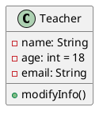
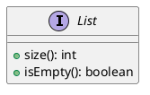
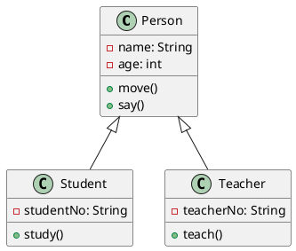
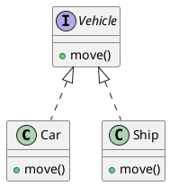
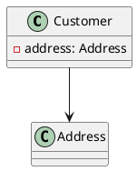
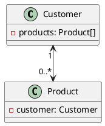
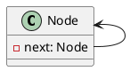
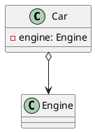
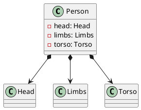
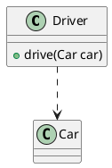

---
tags:
  - Java/DesignPattern
create_time: 2025-02-28T18:42:00
update_time: 2025/06/14 23:54
priority: 1
---

## 类

在 UML 类图中，**类**用一个包含**类名**、**属性**和**方法**的**三层矩形框**表示。如下图中的 `Teacher` 类包含三个属性：`name`、`age` 和 `email`，以及一个方法 `modifyInfo()`：



### 可见性修饰符

定义属性或者方法时，可以使用特殊符号定义相应条目的可访问性质。

| **字符** | **图标 (属性)**                                       | **图标 (方法)**                                       | **可访问性**        | 含义       |
| ------ | ------------------------------------------------- | ------------------------------------------------- | --------------- | -------- |
| `-`    |  |  | `private` 私有    | 仅限类内部访问  |
| `#`    |  |  | `protected` 受保护 | 同包或子类访问  |
| `~`    |  |  | `default` 包内可见  | 仅限同包中类访问 |
| `+`    |  |  | `public` 公有     | 任意类都可访问  |

- **属性**的完整表示形式：[可见性] 属性名称: 类型[ = 缺省值]
- **方法**的完整表示形式：[可见性] 方法名称 ([参数列表])[: 返回类型]，若无返回类型可省略冒号，默认为 `void`

### 静态与抽象

- `{static}`：**静态属性**或**静态方法**用**下划线**表示。如下图所示，在 `hutool` 的 `IdcardUtil` 类中，存在一个 `CHINA_ID_MIN_LENGT` 静态属性和一个 `isValidCard()` 静态方法。

	```plantuml
	@startuml
	
	class IdcardUtil {
	  - {static} CHINA_ID_MIN_LENGT: int = 15
	  + {static} isValidCard(String idCard): boolean
	}
	
	@enduml
	```

- `{abstract}`：**抽象类**或**抽象方法**用**斜体**表示。如下图所示，在 `Employee` 抽象类中，存在 `address`、`name`、`number` 三个属性和两个方法 `mailCheck()` 和 `computePay()`，其中 `computePay()` 方法是一个抽象方法。

	```plantuml
	@startuml
	
	abstract class Employee {
	  - address: String
	  - name: String
	  - number: int
	  + mailCheck()
	  + {abstract} computePay(): double
	}
	
	@enduml
	```

## 接口

与类的表示法不同的是，**接口**在类图中的**第一层顶端用构造型 `<<interface>>` 表示，下面是接口的名字，第二层是方法**。如下图所示，在 `List` 接口中，存在以下方法 `size()` 和 `isEmpty()`。在 [PlantUML](https://plantuml.com/zh/class-diagram) 中接口的表现形式与前面描述的有点不一样，不过没关系。



## 类之间的关系

| **类型**    | **符号**  | **目的**                                           |
| --------- | ------- | ------------------------------------------------ |
| [[#泛化关系]] | `<\|--` | 表示 "**is-a**" 的关系，子类继承父类，复用其属性和方法                |
| [[#实现关系]] | `<\|..` | 类实现接口，承诺提供接口中声明的方法                               |
| [[#关联关系]] | `-->`   | 一个对象知道并使用另一个对象，通常通过成员变量建立引用关系                    |
| [[#聚合关系]] | `o--`   | 表示 "**has a**" 的关系，整体包含部分，但部分可以脱离整体单独存在，生命周期互不依赖 |
| [[#组合关系]] | `*--`   | 整体和部分是共生关系，整体消亡时部分也随之销毁                          |
| [[#依赖关系]] | `..>`   | 短暂使用关系，如在方法参数中用到另一个类                             |

可以用 `..` 来代替 `--` ，会显示为虚线。

### 泛化关系

泛化关系（Generalization）是**耦合度最高**的一种关系，是"**is-a**"关系，是**继承**关系，用于描述**父类与子类之间的关系**，父类又称作基类或超类，子类又称作派生类。继承关系对应的是 `extends` 关键字，在 UML 类图中用**空心三角和实线组成的箭头**表示，**箭头指向父类**。如下图所示中，`Student` 类与 `Teacher` 类继承自 `Person` 类。



### 实现关系

实现关系（Realization）是指**接口及其实现类之间的关系**。实现关系对应的是 `implement` 关键字。在 UML 类图中用**空心三角和虚线组成的箭头**来表示，**箭头指向接口**。如下图所示，`Car` 类与 `Ship` 类都实现了 `Vehicle` 接口。



### 关联关系

关联关系（Association）是一种**拥有关系**，**它使一个类知道另一个类的属性和方法**。在 Java 中，关联关系的代码表现形式为**一个对象持有另一个对象的引用**。关联关系又可进一步分为**单向关联**、**双向关联**和**自关联**。

#### 单向关联

在 UML 类图中，单向关联用一个**带箭头的实线**表示，**箭头指向被关联的对象**。如下图所示，`Customer` 类持有一个类型为 `Address` 的成员变量。



#### 双向关联

所谓的双向关联就是**双方各自持有对方的引用**。在 UML 类图中，双向关联关系用**带双箭头的实线**或者**无箭头的实线**表示。如下图所示，在 `Customer` 类中维护一个 `Product[]` 数组，表示一个顾客购买了那些产品；在 `Product` 类中维护一个 `Customer` 类型的成员变量，表示这个产品被哪个顾客所购买。



一个对象可以持有其它对象的数组或者集合。在 UML 类图中，可以通过放置**多重性（multipicity）表达式**在关联线的末端来表示。多重性表达式可以是一个数字、一段范围或者是它们的组合。多重性允许的表达式示例如下：

- 数字：精确的数量
- \*或者 0..\*：表示 0 到多个
- 0..1：表示 0 或者 1 个
- 1..\*：表示 1 到多个

#### 自关联

在 UML 类图中，自关联用一个**带箭头且指向自身的直线**表示。如下图所示，在单向链表 `Node` 中会维护一个 `Node` 类型的成员变量作为其后继节点 `next`。



### 聚合关系

聚合关系（Aggregation）是**关联关系的一种特例**，它**体现的是整体与部分的包含关系**，即 "**has a**" 的关系。聚合关系强调是"整体"包含"部分"，但是"部分"可以脱离"整体"而单独存在，即整体和部分是**可以分离**的，**有各自的生命周期**。在 UML 类图中，聚合关系用**带空心菱形和箭头的直线**表示，**空心菱形在整体一方**，**箭头指向部分一方**。如下图所示，汽车包含发动机，而发动机脱离了汽车也能单独存在。



### 组合关系

组合关系（Composition）也是**关联关系的一种特例**，它同样**体现的是整体与部分间的包含关系**，即 "**contains a**" 的关系。但此时**整体与部分是不可分的**，部分也不能给其它整体共享，**整体可以控制部分的生命周期**，**整体一旦不存在**，**部分也便不存在**。这种关系比聚合更强，也称为**强聚合**。在 UML 类图中，组合关系用**带实心菱形和箭头的直线**表示，**实心菱形在整体一方**，**箭头指向部分一方**。如下图所示，人包含头（head）、躯干（limbs）、四肢（torso），它们的生命周期一致。当人出生时，头、躯干、四肢同时诞生。当人死亡时，作为人体组成部分的头、躯干、四肢则同时死亡。



### 依赖关系

依赖关系（Dependency）是一种**弱关联**关系，是一种**使用**关系，即 "**use a**" 的关系。可以理解为一个类用到了另一个类中的方法和属性，只要在类中用到了对方就是依赖关系。在 UML 类图中，依赖关系用**一条带有箭头的虚线**表示，**箭头指向被使用方**。如下图所示，驾驶员和汽车的关系，驾驶员使用汽车，二者之间就是依赖关系。


