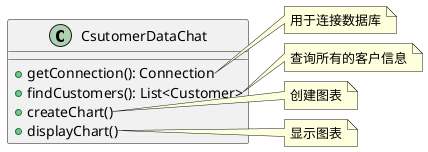
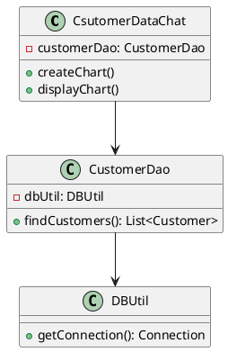
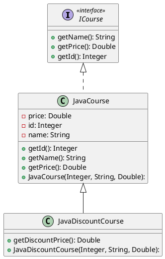
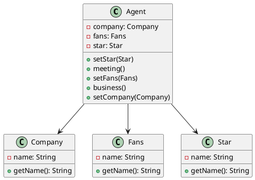
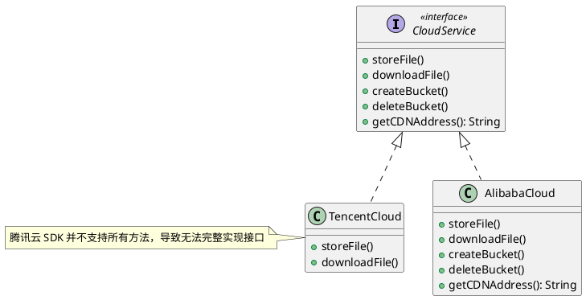
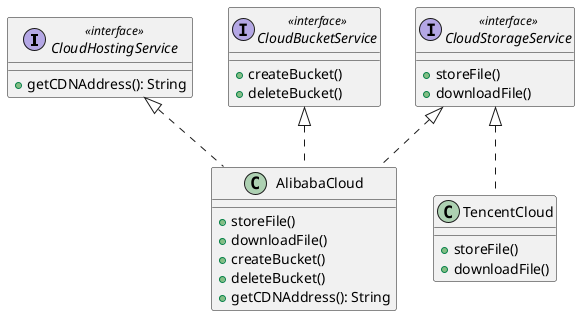
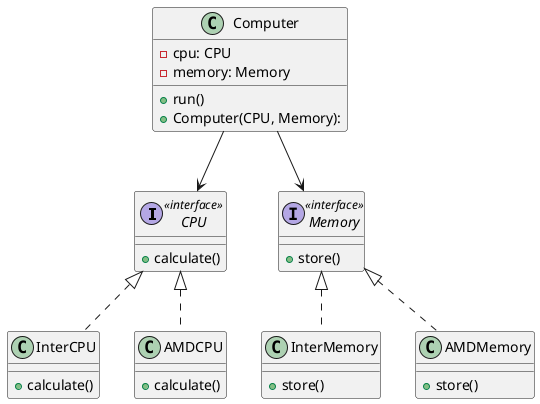
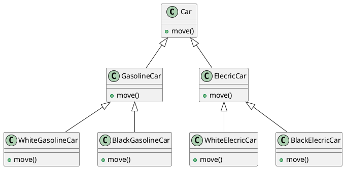
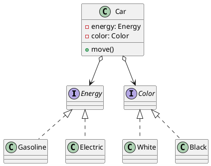

---
tags:
  - Java/DesignPattern
update_time: 2025/06/22 19:06
create_time: 2025-06-15T18:55:00
priority: 10
---

## 单一职责原则

单一职责原则（Single Responsibility Principle，SRP）指的是：**一个类应该只有一个引起它变化的原因**。也就是说，**一个类只负责一项功能或职责**。如果一个类承担了多个互不相关的职责，就应该将其**拆分为职责更单一、粒度更细的类**。

这样的设计可以显著降低类的复杂度，提高可读性和可维护性，减少功能变更时对系统其他部分的影响。简而言之：**类、接口或方法应聚焦于一项职责。**

单一职责原则是实现**高内聚、低耦合**的关键，它看似简单，实则要求较强的**架构分析能力与设计经验**，因为识别一个类中是否存在多个职责，并合理拆分，是一个技术与经验兼具的过程。

举个栗子：以 Sunny 公司 CRM 系统中的 "客户信息图形统计模块" 为例，初始设计如下：



在这个设计中，`CsutomerDataChat` 类承担了三类职责：

1. 数据库连接（`getConnection()`）；
2. 客户数据查询（`findCustomers()`）；
3. 图表生成与展示（`createChart()` 和 `displayChart()`）。

这显然违反了单一职责原则。未来无论数据库连接方式改变，还是图表展示逻辑变动，都会导致 `CsutomerDataChat` 被频繁修改，增加了维护成本，也降低了复用性。

🚀为了符合单一职责原则，我们将其拆分为以下三个类：

1. `DBUtil`：专注于数据库连接；
2. `CustomerDao`：负责 `Customer` 数据表的查询；
3. `CsutomerDataChat`：负责图表的生成与展示。

拆分后的类结构图如下所示：



通过这样的重构，每个类只关注一个方面的变化，职责清晰，功能解耦，有助于提高系统的可扩展性和稳定性。

## 开闭原则

开闭原则（Open-Closed Principle，OCP）是面向对象设计的核心原则之一，指的是：软件实体（如类、模块、函数等等）**应对扩展开放，对修改封闭**。即在新增功能时，应通过**扩展现有代码**来实现，而不应修改已有逻辑，从而提升系统的**稳定性、可维护性和复用性**。

开闭原则强调：**用抽象构建系统框架，用具体实现扩展系统功能**。当需求变化时，只需基于稳定的抽象新增实现类，即可实现新功能，无需修改原有逻辑，从而降低改动带来的风险。

其核心思想是：**面向抽象编程，而非面向具体实现**。抽象更具稳定性，依赖抽象可避免频繁修改；通过继承与多态机制，可灵活扩展功能，实现对扩展开放、对修改封闭的目标。

举个栗子：以某学院的课程体系为例来说明开闭原则的应用。首先定义一个课程接口 `ICourse`：

```java
public interface ICourse {
  Integer getId();
  String getName();
  Double getPrice();
}
```

假设该学院提供多种课程，如 Java 架构、大数据、AI、前端、测试等。以 Java 架构课程为例，创建其实现类 `JavaCourse`：

```java
public class JavaCourse implements ICourse {
	private final Integer id;
	private final String name;
	private final Double price;
	
	public JavaCourse(Integer id, String name, Double price) {
		this.id = id;
		this.name = name;
		this.price = price;
	}
	
	@Override
	public Integer getId() {
		return id;
	}
	
	@Override
	public String getName() {
		return name;
	}
	
	@Override
	public Double getPrice() {
		return price;
	}
}
```

现在我们希望对 Java 课程做限时折扣。有些初学者可能会直接修改原有方法：

```java hl:3
@Override
public Double getPrice() {
  return price * 0.6;
}
```

这种做法虽然简单直接，但违反了**开闭原则**。因为**直接修改已有代码会带来不可预期的副作用**，可能影响其他依赖该类的模块，尤其在实际项目中，类之间往往存在复杂的耦合关系。

🚀正确做法是：**不改动原类，而是通过继承扩展其功能**。我们可以新增一个 `JavaDiscountCourse` 类，继承自 `JavaCourse`，并在其中添加折扣逻辑：

```java hl:6-8
public class JavaDiscountCourse extends JavaCourse {
  public JavaDiscountCourse(final Integer id, final String name, final Double price) {
    super(id, name, price);
  }

  public Double getDiscountPrice() {
    return super.getPrice() * 0.6;
  }
}
```

这样，我们在不改动原有代码的前提下，实现了功能扩展，符合开闭原则。

🤔 **思考延伸**：为何不设计一个通用折扣类如 `DiscountCourse` 呢？因为不同课程可能有不同的折扣策略，统一处理反而增加耦合。更合理的方式是**每种课程根据自身业务需要继承并扩展**，保持灵活性。

类结构图如下所示：



## 里氏替换原则

里氏替换原则（Liskov Substitution Principle，LSP）指出：**凡是父类能够出现的地方，子类必须能够透明地替换父类，并保证程序逻辑行为不变，正确性不被破坏。**

简而言之：**子类应当扩展父类的功能，而不是修改其原有行为。**

这一原则可以细化为以下几点要求：

1. 子类可以实现父类的抽象方法，但**不应重写或破坏父类的已有实现逻辑**；
2. 子类可以添加自身特有的方法；
3. 如果重写父类方法，其**输入参数应更宽松或相等**（前置条件弱化）；
4. 返回结果或行为应**更严格或等同于父类的期望**（后置条件加强）。

遵循里氏替换原则的好处包括：

- 避免继承泛滥带来的错误设计；
- 是实现[[#开闭原则]]的重要前提；
- 增强程序的**健壮性、可维护性与扩展性**；
- 降低因子类改动引发的风险。

举个栗子："正方形不是长方形" 是一个理解里氏替换原则的最经典的例子。在数学领域中，**正方形是一个长宽相等的特殊长方形**，因此我们往往自然地让 `Square` 继承自 `Rectangle`。但在面向对象设计中，这种做法却可能违反里氏替换原则。

首先，定义一个 `Rectangle` 类：

```java
public class Rectangle {
	private long length;
	private long width;

	public long getLength() {
		return length;
	}

	public void setLength(final long length) {
		this.length = length;
	}

	public long getWidth() {
		return width;
	}

	public void setWidth(final long width) {
		this.width = width;
	}
}
```

然后，定义 `Square` 类继承自 `Rectangle`，并强制要求长宽一致：

```java
public class Square extends Rectangle {
	@Override
	public void setWidth(final long width) {
		super.setWidth(width);
		super.setLength(width);
	}

	@Override
	public void setLength(final long length) {
		super.setWidth(length);
		super.setLength(length);
	}
}
```

创建 `resize()` 方法，用于模拟长方形的宽度逐步递增直至超过其长度时终止：

```java
class RectangleTest {
	public void resize(final Rectangle rectangle) {
		while (rectangle.getWidth() <= rectangle.getLength()) {
			rectangle.setWidth(rectangle.getWidth() + 1);
			System.out.println("length:" + rectangle.getLength() + ",width:" + rectangle.getWidth());
		}
	}

	@Test
	public void testRectangle() {
		final Rectangle rectangle = new Rectangle();
		rectangle.setLength(10);
		rectangle.setWidth(5);
		resize(rectangle);
	}
	
	@Test
	public void testSquare() {
		Square square = new Square();
		square.setLength(10);
		resize(square); // ❌ 死循环，最终堆栈溢出
	}
}
```

- `resize()` 方法的核心假设是：**长度保持不变，宽度递增，直到超过长度时终止**；
- 但对于 `Square`，**设置宽度会同时修改长度**，违背了这一假设，导致逻辑异常并引发死循环。

将 `Square` 传入 `resize()` 方法，**破坏了程序对 `Rectangle` 的正常假设**，说明 `Square` 无法替代 `Rectangle`。因此：**在面向对象设计中，正方形不是长方形。**

这也印证了里氏替换原则的本质：**子类必须完全兼容父类的行为规范，否则就不应继承。**

## 迪米特法则

迪米特法则（Law of Demeter，LOD），也称最少知道原则（Least Knowledge Principle，LKP）。是指**一个类对于其他类知道的越少越好** & **只与你的直接 "朋友" 交流，不跟 "陌生人" 说话**（Talk only to your immediate friends and not to strangers）。

具体来说：

- **如果两个对象没有必然的直接通信需求，就不应发生调用关系**，可以通过中介（如第三方对象）进行转发或协调。
- **目的是降低耦合度、提高模块的独立性和系统的可维护性**。

在迪米特法则中，**"朋友" 指的是与当前对象存在耦合关系（如依赖、关联、聚合或组合）的对象**：

- 包括**出现在成员变量、方法参数或返回值中的类**；
- 不包括**出现在方法内部临时变量中的类**。

举个栗子：明星由于全身心投入艺术，所以许多日常事务由经纪人负责处理，如与粉丝的见面会，与媒体公司的业务洽谈等。这里的经纪人就是明星的朋友，而粉丝和媒体公司就是陌生人，所以适合使用迪米特法则。其类结构图如下所示：



具体代码实现如下所示：

```java file:Star
public class Star {
	private final String name;

	public Star(final String name) {
		this.name = name;
	}

	public String getName() {
		return name;
	}
}
```

```java file:Fans
public class Fans {
  private final String name;

  public Fans(final String name) {
    this.name = name;
  }

  public String getName() {
    return name;
  }
}
```

```java file:Company
public class Company {
  private final String name;

  public Company(final String name) {
    this.name = name;
  }

  public String getName() {
    return name;
  }
}
```

```java file:Agent
public class Agent {
  private Star star;
  private Fans fans;
  private Company company;

  public void setStar(final Star star) {
    this.star = star;
  }

  public void setFans(final Fans fans) {
    this.fans = fans;
  }

  public void setCompany(final Company company) {
    this.company = company;
  }

  public void meeting() {
    System.out.println(this.fans.getName() + "与明星" + this.star.getName() + "见面了！");
  }

  public void business() {
    System.out.println(this.company.getName() + "与明星" + this.star.getName() + "洽淡业务！");
  }
}
```

```java file:AgentTest
class AgentTest {
  @Test
  public void test() {
    Star star = new Star("刘亦菲");
    Fans fans = new Fans("小让");
    Company company = new Company("中国传媒有限公司");
    Agent agent = new Agent();
    agent.setStar(star);
    agent.setFans(fans);
    agent.setCompany(company);
    agent.meeting();
    agent.business();
  }
}
```

## 接口隔离原则

接口隔离原则（Interface Segregation Principle，ISP）强调：**应将接口拆分为多个专用接口，避免让客户端依赖它不需要的功能**。在接口设计中应遵循以下几点：

- 一个类对另一个类的依赖应建立在最小的接口之上；
- 接口应职责单一，避免设计成臃肿的大接口；
- 接口方法应精炼、明确，做到适度拆分，避免过细导致结构复杂。

虽然接口隔离原则与[[#单一职责原则]]都强调 "**高内聚、低耦合**"，但两者的侧重点不同：

- **单一职责原则**关注的是类的职责划分，约束的是类的实现；
- **接口隔离原则**关注的是接口的粒度控制，约束的是抽象层与调用方的依赖关系。

良好的接口拆分有助于提高代码的可读性、可维护性和扩展性。在接口设计阶段，应深入理解业务模型，并提前考虑未来可能的演进方向，以便更合理地组织抽象能力。

举个栗子：以公有云存储为例，假设我们定义了一个抽象接口 `CloudService`，其中包含所有可能涉及的存储操作方法。底层实现分别为阿里云（`AlibabaCloud`）和腾讯云（`TencentCloud`）。然而，腾讯云的 SDK 仅支持文件的存储与下载功能，无法实现接口中的其他方法。为满足接口要求，只能在 `TencentCloud` 中实现大量空方法，导致接口"名存实亡"，违背了接口隔离原则。示意如下：



🚀更合理的做法是将 `CloudService` 拆分为多个职责明确的接口，客户端可按需实现，避免不必要的依赖：



拆分之后的优势：

- **职责清晰**：每个接口仅包含一类能力；
- **依赖最小**：实现类只需关注自己具备的功能；
- **易于扩展**：新增能力可通过新接口扩展，互不影响；
- **避免冗余**：无须实现空方法或无效逻辑。

> [!note]
> **接口的拆分应保持合理粒度，过度细化可能反而导致代码复杂、难以维护**，应在灵活性与复杂度之间找到平衡点。

## 依赖倒置原则

依赖倒置原则（Dependence Inversion Principle，DIP）强调：**高层模块不应依赖低层模块，二者都应依赖于抽象；抽象不应依赖细节，细节应依赖抽象**（High-level modules should not depend on low-level modules.Both should depend on abstractions.Abstractions should not depend on details.Details should depend on abstractions）。

> [!important]
>
> 核心思想：<strong style="color:#ae3520;font-size:19px">面向接口编程，而非面向实现编程！</strong>

通过依赖倒置，可以降低模块间的耦合度，提高系统的灵活性、可维护性与可扩展性。**以抽象为基准构建系统**，比依赖具体细节更稳定可靠。因此在设计代码结构时，应**先定义顶层接口框架，再实现具体细节**。

举个栗子：假设现在我们要组装一台电脑，初始配置为 Intel 的 CPU 和内存条，代码如下：

```java file:InterCPU
public class InterCPU {
	public void calculate() {
		System.out.println("Intel CPU 正在运行中...");
	}
}
```

```java file:InterMemory
public class InterMemory {
	public void store() {
		System.out.println("Intel 内存条正在存储数据中...");
	}
}
```

```java file:Computer hl:2-3
public class Computer {
  private final InterCPU interCPU;
  private final InterMemory interMemory;

  public Computer(InterCPU interCPU, InterMemory interMemory) {
    this.interCPU = interCPU;
    this.interMemory = interMemory;
  }

  public void run() {
    interCPU.calculate();
    interMemory.store();
  }
}
```

```java file:ComputerTest
class ComputerTest {
  @Test
  public void test() {
    InterCPU interCPU = new InterCPU();
    InterMemory interMemory = new InterMemory();
    Computer computer = new Computer(interCPU, interMemory);
    computer.run();
  }
}
```

当预算紧张，想将配置从 Intel 换成 AMD 时，由于 `Computer` 类直接依赖于具体的 Intel 实现，必须**修改已有代码**才能支持新实现，这违反了[[#开闭原则]]（类应该**对扩展开放、对修改关闭**）。

🚀正确的做法是：**定义抽象接口，让 `Computer` 依赖接口而不是具体实现**，以实现灵活的替换与扩展。

我们先定义 `CPU` 和 `Memory` 两个接口，并让 Intel 和 AMD 各自实现：

```java file:CPU
public interface CPU {
  void calculate();
}
```

```java file:Memory
public interface Memory {
  void store();
}
```

```java file:IntelCPU
public class InterCPU implements CPU {
  @Override
  public void calculate() {
    System.out.println("Intel CPU 正在运行中...");
  }
}
```

```java file:IntelMemory
public class InterMemory implements Memory {
  @Override
  public void store() {
    System.out.println("Intel 内存条正在存储数据中...");
  }
}
```

```java file:AMDCPU
public class AMDCPU implements CPU {
  @Override
  public void calculate() {
    System.out.println("AMD CPU 正在运行中...");
  }
}
```

```java file:AMDMemory
public class AMDMemory implements Memory {
  @Override
  public void store() {
    System.out.println("AMD 内存条正在存储数据中...");
  }
}
```

```java file:Computer hl:2-3
public class Computer {
  private final CPU cpu;
  private final Memory memory;

  public Computer(final CPU cpu, final Memory memory) {
    this.cpu = cpu;
    this.memory = memory;
  }

  public void run() {
    cpu.calculate();
    memory.store();
  }
}
```

```java file:ComputerTest
class ComputerTest {
  @Test
  public void testIntelConfig() {
    InterCPU interCPU = new InterCPU();
    InterMemory interMemory = new InterMemory();
    Computer computer = new Computer(interCPU, interMemory);
    computer.run();
  }

  @Test
  public void testAMDConfig() {
    AMDCPU amdCPU = new AMDCPU();
    AMDMemory amdMemory = new AMDMemory();
    Computer computer = new Computer(amdCPU, amdMemory);
    computer.run();
  }
}
```

现在我们无需修改 `Computer` 类，只需传入不同品牌的实现即可完成配置切换，符合**开闭原则（对扩展开放，对修改关闭）**，也满足**依赖倒置原则（依赖抽象而非细节）**。

类结构图如下所示：



## 合成复用原则

合成复用原则（Composite Reuse Principle）强调：**应尽量使用对象[[UML 类图#组合关系|组合]]（contains-a）或[[UML 类图#聚合关系|聚合]]（has-a）**，**而不是 [[UML 类图#泛化关系|继承]]（is-a）关系** 来实现代码复用。

> [!important]
>
> <strong style="color:#ae3520;font-size:19px">多用组合，少用继承！</strong>

类的复用方式主要有两种：**继承复用**和**组合复用**。

继承虽然实现简单，但存在以下缺点：

- **破坏封装性**：**继承会将父类的实现细节暴露给子类，父类对子类来说是透明的**，因此继承也被称为 "白箱复用"。
- **耦合度高**：父类变动会影响所有子类，不利于扩展和维护。
- **灵活性差**：继承关系在编译期确定，运行时无法动态替换。

而组合（聚合）复用方式通过将已有对象作为成员纳入新类中，可带来更多优势：

- **封装性更好**：成员对象对外是 "黑箱"，不暴露内部实现。
- **耦合更低**：通过依赖抽象（接口或抽象类），成员对象变动不会影响整体结构。
- **更灵活**：可以在运行时动态替换或配置组合对象。

举个栗子：以汽车分类为例，按动力可分为汽油车、电动车，按颜色可分为白色、黑色。如果用继承方式组合这两个维度，会产生大量子类：



如上图所示，每增加一种颜色或动力类型，都会导致子类爆炸式增长，扩展性极差。

🚀改进方案：我们可以将**动力类型**和**颜色**抽象为接口，使用**组合（聚合）**方式注入，避免子类膨胀：



通过组合不同的 `Energy` 和 `Color` 实现类，就可以灵活构造各种汽车实例，新增分类也无需修改原有结构，符合[[#开闭原则]]。
