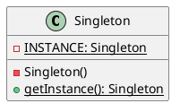

---
tags:
  - Java/DesignPattern
create_time: 2025-06-14 19:25
update_time: 2025/06/20 19:06
priority: 1
---

## 定义

单例模式（Singleton）是一种<mark style="background: #ABF7F7A6;">创建型</mark>设计模式，旨在保证**一个类仅有一个实例**，并**提供一个访问该实例的全局访问点**。


## 类图



## 实现方式

- **静态成员变量**：定义一个私有的静态成员变量 `INSTANCE`（类型为 `Singleton`），用于存储该类的唯一实例。
- **私有构造方法**：将构造方法私有化，防止外部使用 `new` 操作符直接创建对象实例。
- **全局访问点**：提供一个静态方法 `getInstance()` 作为全局访问点，该方法会返回存储在 `INSTANCE` 中的单例对象。

| 实现方式       | 线程安全 | 防反射 | 防序列化 | 延迟加载 | 简洁性 | 推荐程度        |
| ---------- | ---- | --- | ---- | ---- | --- | ----------- |
| [[#饿汉式]]   | ✅    | ❌   | ❌    | ❌    | 简单  | ⭐⭐          |
| [[#懒汉式]]   | ❌    | ❌   | ❌    | ✅    | 一般  | ⭐           |
| [[#双重检查锁]] | ✅    | ❌   | ❌    | ✅    | 一般  | ⭐⭐          |
| [[#静态内部类]] | ✅    | ❌   | ❌    | ✅    | 简洁  | ⭐⭐⭐         |
| [[#枚举单例]]  | ✅    | ✅   | ✅    | ❌    | 最简洁 | ⭐⭐⭐⭐ ✅ 强烈推荐 |

### 饿汉式

- 特点：**类加载时**即创建实例，**线程安全**但**无法延迟加载**。
- 优缺点：
	- ✅ **优点**：无锁高效，性能优于[[#懒汉式]]；
	- ❌ **缺点**：可能浪费内存（未使用即创建）。

```java hl:2,4-5,7-9
public class HungrySingleton {  
  private static final HungrySingleton INSTANCE = new HungrySingleton();  
  
  private HungrySingleton() {
  }  
  
  public static HungrySingleton getInstance() {  
    return INSTANCE;  
  }  
}
```

在上述代码中：

- **私有构造方法**禁止外部直接创建对象，确保外部无法实例化；
- 静态常量 `INSTANCE` 在**类加载时初始化一次**，保证实例唯一且不可变；
- 提供静态方法 `getInstance()` 作为**全局访问点**，对外暴露单例对象。

### 懒汉式

首次调用 `getInstance()` 方法时才会创建实例，具备**延迟加载**特性，但在多线程环境下**不安全**。

```java hl:2,4-5,7-12
public class LazySingleton {  
  private static LazySingleton INSTANCE;  
  
  private LazySingleton() {  
  }  
  
  public static LazySingleton getInstance() {  
    if (INSTANCE == null) {  
      INSTANCE = new LazySingleton();  
    }  
    return INSTANCE;  
  }  
}
```

测试方法：

```java
@Test  
public void testLazySingleton() {  
	Runnable runnable = () -> {  
		LazySingleton instance = LazySingleton.getInstance();  
		LOGGER.info("{}：{}", Thread.currentThread().getName(), instance);  
	};  
	Thread t1 = new Thread(runnable);  
	Thread t2 = new Thread(runnable);  
	t1.start();  
	t2.start();  
}  
```

测试结果：

```
23:00:20.943 [Thread-0] INFO fun.xiaorang.study.designpattern.singleton.ApiTest -- Thread-0：fun.xiaorang.study.designpattern.singleton.LazySingleton@4e54ffd6
23:00:20.943 [Thread-1] INFO fun.xiaorang.study.designpattern.singleton.ApiTest -- Thread-1：fun.xiaorang.study.designpattern.singleton.LazySingleton@6d2b14bd
```

💥 两个线程获取的实例地址不同，说明该实现**线程不安全**，可能创建多个实例，破坏单例约束。

### 双重检查锁

鉴于前面提到的[[#懒汉式]]单例模式在多线程环境下不安全，最直接的改进方式是：为 `getInstance()` 添加 **`synchronized`** 关键字，保证线程安全：

```java hl:2,4-5,7-12
public class LazySingleton {  
  private static LazySingleton INSTANCE;  
  
  private LazySingleton() {  
  }  
  
  public synchronized static LazySingleton getInstance() {  
    if (INSTANCE == null) {  
      INSTANCE = new LazySingleton();  
    }  
    return INSTANCE;  
  }  
}
```

测试方法：

```java
@Test  
public void testLazySyncSingleton() {  
  Runnable runnable = () -> {  
    LazySyncSingleton instance = LazySyncSingleton.getInstance();  
    LOGGER.info("{}：{}", Thread.currentThread().getName(), instance);  
  };  
  Thread t1 = new Thread(runnable);  
  Thread t2 = new Thread(runnable);  
  t1.start();  
  t2.start();  
}
```

运行时我们会看到：当一个线程调用 `getInstance()` 时，另一个线程会被阻塞（状态变为 `MONITOR`），直至前者完成。如下图所示：


测试结果：

```
23:14:33.471 [Thread-0] INFO fun.xiaorang.study.designpattern.singleton.ApiTest -- Thread-0：fun.xiaorang.study.designpattern.singleton.LazySyncSingleton@8b43eba
23:14:33.471 [Thread-1] INFO fun.xiaorang.study.designpattern.singleton.ApiTest -- Thread-1：fun.xiaorang.study.designpattern.singleton.LazySyncSingleton@8b43eba
```

尽管上述做法解决了线程安全问题，但**每次访问都要加锁，释放，开销较大，性能较差**。那有没有更优解呢？
🚀推荐方案：使用**双重检查锁（Double-Checked Locking，DCL）优化同步范围，仅在首次创建实例时加锁**，兼顾安全与性能：

```java hl:2,4-5,7-16
public class LazyDoubleCheckSingleton {  
  private static volatile LazyDoubleCheckSingleton INSTANCE;  
  
  private LazyDoubleCheckSingleton() {  
  }  
  
  public static LazyDoubleCheckSingleton getInstance() {  
    if (INSTANCE == null) {  
      synchronized (LazyDoubleCheckSingleton.class) {  
        if (INSTANCE == null) {  
          INSTANCE = new LazyDoubleCheckSingleton();  
        }  
      }  
    }  
    return INSTANCE;  
  }  
}
```

> [!tip] 关键点
> **`INSTANCE` 必须使用 `volatile` 修饰，防止<mark style="background: #FFB8EBA6;">指令重排</mark>导致对象未完全构造就被其他线程读取**。

测试方法：

```java
@Test  
public void testLazyDoubleCheckSingleton() {  
  Runnable runnable = () -> {  
    LazyDoubleCheckSingleton instance = LazyDoubleCheckSingleton.getInstance();  
    LOGGER.info("{}：{}", Thread.currentThread().getName(), instance);  
  };  
  Thread t1 = new Thread(runnable);  
  Thread t2 = new Thread(runnable);  
  t1.start();  
  t2.start();  
}
```

测试结果：

```
13:03:39.795 [Thread-0] INFO fun.xiaorang.study.designpattern.singleton.ApiTest -- Thread-0：fun.xiaorang.study.designpattern.singleton.LazyDoubleCheckSingleton@58f08ea5
13:03:39.795 [Thread-1] INFO fun.xiaorang.study.designpattern.singleton.ApiTest -- Thread-1：fun.xiaorang.study.designpattern.singleton.LazyDoubleCheckSingleton@58f08ea5
```

✅ 无论运行多少次，**多线程下始终返回同一个实例，线程安全**。

> [!note]
> 虽然 DCL 性能较好，但代码相对复杂，`volatile` 也会限制部分 JVM 优化。**更推荐使用[[#静态内部类]]或[[#枚举单例]]方案。**

### 静态内部类

静态内部类实现方式既解决了[[#饿汉式]]的**资源浪费问题**，也避免了[[#双重检查锁]]的**同步开销**，被认为是懒加载单例的最佳实践之一。

其核心原理：

1. **静态内部类不会随着外部类加载而初始化**，只有在首次调用 `getInstance()` 时才会触发加载；
2. 内部类中的静态变量在**类加载时才会初始化一次，并由 JVM 保证线程安全**。

因此它**天然支持懒加载**，且**无需显式加锁就能保证线程安全**。

```java hl:2-3,5-7,9-11
public class LazyStaticInnerSingleton {  
  private LazyStaticInnerSingleton() {  
  }  
  
  public static LazyStaticInnerSingleton getInstance() {  
    return SingletonHolder.INSTANCE;  
  }  
  
  private static class SingletonHolder {  
    private static final LazyStaticInnerSingleton INSTANCE = new LazyStaticInnerSingleton();  
  }  
}
```

该实现方式结合了**延迟加载**与**线程安全**的优点，结构清晰、执行高效，是实现单例模式的优选方案之一。

### 枚举单例

在《Effective Java》第二版第 3 条中，作者 **Joshua Bloch** 强调：

> **"A single-element enum type is the best way to implement a singleton."**

```java
public enum EnumSingleton {  
	INSTANCE  
}
```

测试方法：

```java
@Test  
public void testEnumSingleton() {  
  Runnable runnable = () -> {  
    EnumSingleton instance = EnumSingleton.INSTANCE;  
    LOGGER.info("{}：{}", Thread.currentThread().getName(), instance);  
  };  
  Thread t1 = new Thread(runnable);  
  Thread t2 = new Thread(runnable);  
  t1.start();  
  t2.start();  
}
```

测试结果：

```
16:35:40.756 [Thread-0] INFO fun.xiaorang.study.designpattern.singleton.ApiTest -- Thread-0：INSTANCE
16:35:40.757 [Thread-1] INFO fun.xiaorang.study.designpattern.singleton.ApiTest -- Thread-1：INSTANCE
```

相比传统的[[#饿汉式]]、[[#懒汉式]]、[[#双重检查锁]]等实现方式，枚举单例具备以下优势：

- **简洁优雅**：无需显示构造、同步控制或懒加载逻辑；
- **线程安全**：JVM 保证枚举类在加载时只初始化一次；
- **[[#天然防反射攻击]]**：无法通过反射实例化；
- **[[#天然防序列化破坏]]**：反序列化始终返回同一实例；

🚀枚举单例本质上属于[[#饿汉式]]实现，**如果不需要延迟加载，它是最安全、最推荐的实现方式。

## 存在的问题

除[[#枚举单例]]外的其他单例实现方式（如[[#饿汉式]]、[[#懒汉式]]、[[#双重检查锁]]、[[#静态内部类]]）都存在被**反射**或**反序列化**破坏的风险，从而创建多个实例，导致单例失效。

### 反射破坏单例模式

#### 问题复现

```java
@Test  
public void testReflectDestroyLazyStaticInnerSingleton() throws NoSuchMethodException, InvocationTargetException, InstantiationException, IllegalAccessException {  
  Class<LazyStaticInnerSingleton> clazz = LazyStaticInnerSingleton.class;  
  // 通过反射的方式获取私有构造方法  
  final Constructor<LazyStaticInnerSingleton> constructor = clazz.getDeclaredConstructor();  
  // 强制访问  
  constructor.setAccessible(true);  
  // 创建对象  
  final LazyStaticInnerSingleton o1 = constructor.newInstance();  
  LOGGER.info("{}", o1);  
  final LazyStaticInnerSingleton o2 = constructor.newInstance();  
  LOGGER.info("{}", o2);  
  // 判断是否是同一个对象，如果输出的结果为 false，则说明两个对象不是同一个对象，从而说明可以通过反射破坏单例模式  
  LOGGER.info("{}", o1 == o2);  
}
```

测试结果：

``` hl:3
13:25:26.005 [main] INFO fun.xiaorang.study.designpattern.singleton.ApiTest -- instance1: fun.xiaorang.study.designpattern.singleton.LazyStaticInnerSingleton@35e2d654
13:25:26.009 [main] INFO fun.xiaorang.study.designpattern.singleton.ApiTest -- instance2: fun.xiaorang.study.designpattern.singleton.LazyStaticInnerSingleton@4c371370
13:25:26.010 [main] INFO fun.xiaorang.study.designpattern.singleton.ApiTest -- 是否为同一对象: false
```

> [!note]
> 通过反射调用私有构造器，可绕过访问限制，创建多个对象，从而破坏单例约束。

#### 解决方案

可在构造方法中加入防御逻辑：若实例已创建，则抛出异常阻止重复创建。

```java hl:2,5-8
public class LazyStaticInnerSingleton {  
  private static boolean initialized = false;  

  private LazyStaticInnerSingleton() {  
    if (initialized) {  
      throw new RuntimeException("单例对象禁止重复创建");  
    }  
    initialized = true;  
  }  

  public static LazyStaticInnerSingleton getInstance() {  
    return SingletonHolder.INSTANCE;  
  }  

  private static class SingletonHolder {  
    private static final LazyStaticInnerSingleton INSTANCE = new LazyStaticInnerSingleton();  
  }  
}
```

再次运行测试：

```
Exception in thread "main" java.lang.RuntimeException: 单例对象禁止重复创建
```

> [!note]
> 此方式可防止多数反射攻击，但仍可能被字节码篡改、`Unsafe`、或 `AccessibleObject` 等手段绕过。

### 序列化破坏单例模式

即便防住了反射攻击，**反序列化**也可能绕过构造方法，破坏单例约束。

#### 问题复现

> [!note]
> 在测试前需让类实现 `Serializable` 接口，否则会抛出 `NotSerializableException` 异常。

```java
@Test
public void testDeserializeDestroyLazyStaticInnerSingleton() throws Exception {
  LazyStaticInnerSingleton instance1 = LazyStaticInnerSingleton.getInstance();
  try (ObjectOutputStream oos = new ObjectOutputStream(new FileOutputStream("singleton.obj"))) {
    oos.writeObject(instance1);
  }

  try (ObjectInputStream ois = new ObjectInputStream(new FileInputStream("singleton.obj"))) {
    LazyStaticInnerSingleton instance2 = (LazyStaticInnerSingleton) ois.readObject();
    LOGGER.info("instance1: {}", instance1);
    LOGGER.info("instance2: {}", instance2);
    LOGGER.info("是否为同一对象: {}", instance1 == instance2); // false，说明被破坏
  }
}
```

测试结果：

``` hl:3
12:34:08.297 [main] INFO fun.xiaorang.study.designpattern.singleton.ApiTest -- instance1: fun.xiaorang.study.designpattern.singleton.LazyStaticInnerSingleton@411f53a0
12:34:08.301 [main] INFO fun.xiaorang.study.designpattern.singleton.ApiTest -- instance2: fun.xiaorang.study.designpattern.singleton.LazyStaticInnerSingleton@7e6f74c
12:34:08.301 [main] INFO fun.xiaorang.study.designpattern.singleton.ApiTest -- 是否为同一对象: false
```

#### 解决方案

可通过实现 `readResolve()` 方法，在反序列化时返回已有实例，避免新对象创建：

```java
private Object readResolve() throws ObjectStreamException {
  return getInstance();
}
```

完整示例：

```java hl:1,15-17
public class LazyStaticInnerSingleton implements Serializable {  
  private static boolean initialized = false;  
  
  private LazyStaticInnerSingleton() {  
    if (initialized) {  
      throw new RuntimeException("单例对象禁止重复创建");  
    }  
    initialized = true;  
  }  
  
  private Object readResolve() {  
    return getInstance();  
  }  
  
  public static LazyStaticInnerSingleton getInstance() {  
    return SingletonHolder.INSTANCE;  
  }  
  
  private static class SingletonHolder {  
    private static final LazyStaticInnerSingleton INSTANCE = new LazyStaticInnerSingleton();  
  }  
}
```

测试结果：

``` hl:3
12:38:21.515 [main] INFO fun.xiaorang.study.designpattern.singleton.ApiTest -- instance1: fun.xiaorang.study.designpattern.singleton.LazyStaticInnerSingleton@57a3af25
12:38:21.519 [main] INFO fun.xiaorang.study.designpattern.singleton.ApiTest -- instance2: fun.xiaorang.study.designpattern.singleton.LazyStaticInnerSingleton@57a3af25
12:38:21.519 [main] INFO fun.xiaorang.study.designpattern.singleton.ApiTest -- 是否为同一对象: true
```

## 扩展

### JDK 中的单例实现

JDK 中的 `java.lang.Runtime` 类就是典型的[[#饿汉式]]单例模式：

```java
public class Runtime {  
  private static final Runtime currentRuntime = new Runtime();

  public static Runtime getRuntime() {  
    return currentRuntime;  
  }

  private Runtime() {}
}
```

核心要点：

- 构造器私有化，禁止外部创建实例；
- 静态变量 `currentRuntime` 在类加载时初始化，确保唯一；
- 提供 `getRuntime()` 方法作为全局访问点。

该设计确保整个 JVM 生命周期中 `Runtime` 实例唯一，有效避免资源竞争，提升系统稳定性。

### 为什么枚举单例无法被反射和序列化破坏？

#### 天然防反射攻击

尝试通过反射创建枚举实例：

```java
@Test  
public void testReflectDestroyEnumSingleton() throws NoSuchMethodException, InvocationTargetException, InstantiationException, IllegalAccessException {  
  Class<EnumSingleton> clazz = EnumSingleton.class;  
  // 通过反射的方式获取私有构造方法  
  final Constructor<EnumSingleton> constructor = clazz.getDeclaredConstructor();  
  // 关闭访问检查  
  constructor.setAccessible(true);  
  // 创建对象  
  final EnumSingleton instance = constructor.newInstance();  
  LOGGER.info("instance: {}", instance);  
}
```

测试结果：

```
java.lang.NoSuchMethodException: fun.xiaorang.study.designpattern.singleton.EnumSingleton.<init>()
```

说明枚举类不存在无参构造方法。查看其父类 `Enum` 的实际构造方法签名如下：

```java
protected Enum(String name, int ordinal)
```

进一步调用父类 `Enum` 的构造器：

```java hl:5,9
@Test  
public void testReflectDestroyEnumSingleton() throws NoSuchMethodException, InvocationTargetException, InstantiationException, IllegalAccessException {  
  Class<EnumSingleton> clazz = EnumSingleton.class;  
  // 通过反射的方式获取私有构造方法  
  final Constructor<EnumSingleton> constructor = clazz.getDeclaredConstructor(String.class, int.class);  
  // 关闭访问检查  
  constructor.setAccessible(true);  
  // 创建对象  
  final EnumSingleton instance = constructor.newInstance("INSTANCE", 0); // 抛出异常 java.lang.IllegalArgumentException: Cannot reflectively create enum constants  
  LOGGER.info("instance: {}", instance);  
}
```

测试结果：

```
java.lang.IllegalArgumentException: Cannot reflectively create enum objects
```

说明 **JDK 明令禁止通过反射创建枚举实例**。源码中，`Constructor #newInstance ()` 方法包含如下判断逻辑：
![[Pasted image 20250620172545.png]]

🔒**结论**：**枚举实例的创建由 JVM 在类加载阶段控制，反射机制无法绕过**，天然防止反射破坏单例。

#### 天然防序列化破坏

尝试通过序列化破坏枚举单例：

```java
@Test  
public void testDeserializeDestroyEnumSingleton() throws Exception {  
  EnumSingleton instance1 = EnumSingleton.INSTANCE;  
  try (ObjectOutputStream oos = new ObjectOutputStream(new FileOutputStream("singleton.obj"))) {  
    oos.writeObject(instance1);  
  }  
  
  try (ObjectInputStream ois = new ObjectInputStream(new FileInputStream("singleton.obj"))) {  
    EnumSingleton instance2 = (EnumSingleton) ois.readObject();  
    LOGGER.info("instance1: {}", instance1);  
    LOGGER.info("instance2: {}", instance2);  
    LOGGER.info("是否为同一对象: {}", instance1 == instance2); // false，说明被破坏  
  }  
}
```

测试结果：

``` hl:3
17:38:37.812 [main] INFO fun.xiaorang.study.designpattern.singleton.ApiTest -- instance1: INSTANCE
17:38:37.815 [main] INFO fun.xiaorang.study.designpattern.singleton.ApiTest -- instance2: INSTANCE
17:38:37.815 [main] INFO fun.xiaorang.study.designpattern.singleton.ApiTest -- 是否为同一对象: true
```

🧩**原因**：枚举的反序列化过程由 JVM 特殊处理，**始终返回已有枚举常量，不会创建新实例**。
🔒**结论**：枚举无需实现 `readResolve()` 方法，即可从底层避免反序列化破坏。

#### 总结

| 攻击方式  | 是否成功 | 防护机制说明               |
| ----- | ---- | -------------------- |
| 反射攻击  | 否    | JDK 禁止反射创建枚举实例       |
| 序列化攻击 | 否    | JVM 处理保证反序列化返回同一常量实例 |

📌 **[[#枚举单例]]是最安全的实现方式**，从语言层面彻底规避了反射与序列化破坏风险，是《Effective Java》中强烈推荐的最佳方案。
