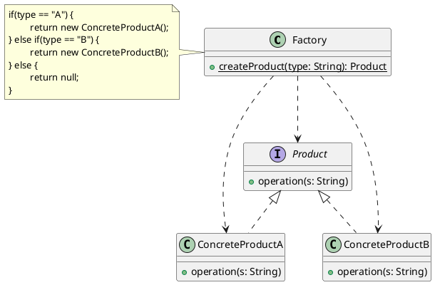

---
tags:
  - Java/DesignPattern
create_time: 2025-06-21 23:28
update_time: 2025/06/24 19:21
priority: 10
---

## 定义

简单工厂模式（Simple Factory），又称**静态工厂方法模式**（Static Factory Method），是一种<mark style="background: #ABF7F7A6;">创建型</mark>设计模式。该模式通过一个**专门的工厂类来封装对象的创建过程**，在其**静态方法中根据传入参数的不同，返回不同类型的实例**，这些实例通常**具有相同的父类或实现相同的接口**。

## 类图



- **Factory（工厂角色）**：简单工厂模式的核心，负责封装所有产品实例的创建逻辑。该类通常提供一个静态方法（这也是该模式又被称为 "静态工厂方法模式" 的原因），根据传入参数的不同返回对应的具体产品实例，这些实例通常具有共同的父类或接口。
- **Product（抽象产品角色）**：定义所有产品的公共接口，是工厂方法的返回类型，也是各具体产品的父类。
- **ConcreteProduct（具体产品角色）**：由工厂创建的具体实例，实现了抽象产品中定义的接口或抽象方法。每一个具体产品类都代表一种具体的产品类型。

## 代码示例

### 基础版

#### 抽象产品角色

某学院目前已开设 Java、大数据、人工智能等课程，形成了一个初步的课程体系。我们先定义一个课程标准接口 `ICourse`：

```java
public interface ICourse {
	/**
	 * 录制课程视频
	 */
	void record();
}
```

#### 具体产品角色

创建 Java 课程实现类 `JavaCourse`：

```java
public class JavaCourse implements ICourse {  
  @Override  
  public void record() {  
    System.out.println("录制 Java 课程");  
  }  
}
```

创建 Python 课程实现类 `PythonCourse`：

```java
public class PythonCourse implements ICourse {  
  @Override  
  public void record() {  
    System.out.println("录制 Python 课程");  
  }  
}
```

#### 工厂角色

- 简单工厂类通常作为**静态工具类**存在，**无需实例化**。为防止外部创建对象，建议将其**构造方法私有化**。
- 命名建议：
    - 类名：`模块名 + Factory`，例如：`CourseFactory`
    - 方法名：`create + 接口名`，例如：`createCourse`

```java hl:2-3
public class CourseFactory {  
  private CourseFactory() {  
  }  
  
  public static ICourse createCourse(String name) {  
    if ("java".equals(name)) {  
      return new JavaCourse();  
    } else if ("python".equals(name)) {  
      return new PythonCourse();  
    } else {  
      return null;  
    }  
  }  
}
```

#### 客户端

```java
class CourseFactoryTest {  
  @Test  
  public void test() {  
    final ICourse course = CourseFactory.createCourse("java");  
    Assertions.assertNotNull(course);  
    course.record();  
  }  
}
```

### 优化版

> [!important]
> 简单工厂的本质是：<strong style="font-size:19px;">选择实现</strong>

简单工厂方法的内部主要实现的功能是 "**选择合适的实现类**" 来创建实例对象。选择条件的来源通常包括：

- 客户端传入的参数；
- 配置文件中定义的类名；

若每新增一个产品（如 Go 课程），都要修改工厂类代码，容易导致：

- 工厂类代码臃肿；
- 不符合[[七大设计原则#开闭原则|开闭原则]]；
- 难以扩展和维护。

🚀解决方案：引入**配置文件 + 反射机制**。当有新的产品时，只需修改配置文件内容，而无需改动工厂类代码。

#### 新的产品类

```java
public class GoCourse implements ICourse {  
  @Override  
  public void record() {  
    System.out.println("录制 Go 课程");  
  }  
}
```

#### 配置文件

```properties file:simple-factory
type=fun.xiaorang.study.designpattern.factory.simple.GoCourse
```

#### 工厂类

```java hl:5-14
public class CourseFactory {  
  private CourseFactory() {  
  }  
  
  public static ICourse createCourse() {  
    try (InputStream in = CourseFactory.class.getClassLoader().getResourceAsStream("simple-factory.properties")) {  
      Properties properties = new Properties();  
      properties.load(in);  
      final String type = properties.getProperty("type");  
      return (ICourse) Class.forName(type).newInstance();  
    } catch (IOException | ClassNotFoundException | InstantiationException | IllegalAccessException e) {  
      throw new RuntimeException(e);  
    }  
  }  
}
```

#### 客户端

```java hl:4
class CourseFactoryTest {  
  @Test  
  public void test() {  
    final ICourse course = CourseFactory.createCourse();  
    Assertions.assertNotNull(course);  
    course.record();  
  }  
}
```

## 模式分析

- **优缺点**：
	- ✅**优点**：
		- **创建与使用分离**：将对象的创建过程从客户端中解耦，客户端无需关心具体实例的创建逻辑，只负责"消费"产品。
		- **使用简单**：通过静态方法创建对象，参数传递简单，使用方便。无需记忆复杂的类名，只需传入标识参数即可。
		- **灵活性提升**：配合配置文件使用，可在不修改客户端代码的前提下扩展新产品类，提高系统的灵活性和可维护性。
	- ❌**缺点**：
		- **工厂职责过重**：所有产品的创建逻辑集中在一个工厂类中，易导致类体积膨胀、维护困难；一旦出错，可能影响全局。
		- **系统复杂度增加**：会引入额外的工厂类，在对象种类较多时，工厂逻辑也会变得复杂。
		- **违反开闭原则**：每新增一个具体产品类，工厂都需要修改创建逻辑，违背 "对扩展开放，对修改关闭" 的设计原则。
		- **缺乏扩展性**：由于使用了静态方法，无法通过继承形成工厂的层级结构，难以实现多态扩展。
- **适用场景**：
	- 工厂类负责创建的对象种类较少；
	- 客户端**无需关心具体实现类**，甚至不需要知道类名，仅需传入产品标识参数；
	- 需要对对象的创建过程进行**集中管理和控制**的场景。

## 何时选用？

- **封装具体实现**：希望对外完全隔离实现类，仅暴露接口，让客户端通过工厂来获取对象。
- **集中管理创建逻辑**：希望将多个不相关对象的创建职责集中到一个类中统一处理，便于维护与控制。

## 常见应用

|类/包名|常用静态工厂方法|
|---|---|
| `java.text.DateFormat` | `getDateInstance()`、`getDateInstance(int style)`、`getDateInstance(int style, Locale)` |
| `java.util.Calendar` | `getInstance()`、`getInstance(TimeZone, Locale)` |

这些类通过静态方法提供不同配置的实例，本质上就是简单工厂模式的运用。

## 总结

- 简单工厂模式是一种<mark style="background:#ABF7F7A6;">创建型</mark>设计模式，通过**在工厂类中定义一个静态方法**，根据传入的参数创建并返回不同类型的产品实例，实现对象的创建与使用分离。
- 由于**违反开闭原则**，**未被 GoF 纳入** 23 种经典设计模式。
- 模式包含三个核心角色：
	- **工厂角色（Factory）**：封装所有产品实例的创建逻辑；
	- **抽象产品角色（Product）**：所有具体产品类的父类或接口；
	- **具体产品角色（ConcreteProduct）**：由工厂创建的具体实现类。
- **本质：选择实现。** 客户端通过参数 "选择" 所需产品类型，工厂内部决定具体的实例化过程。
- **核心优点**：将对象的创建与使用过程解耦，客户端无需了解创建细节。
- **主要缺点**：扩展性较差，新增产品时需修改工厂代码；随着产品种类增多，工厂代码将变得臃肿、难以维护。
