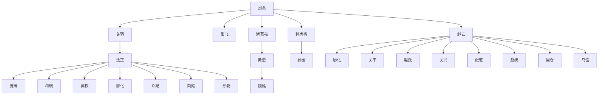

---
tags:
  - SQL
update_time: 2025/04/02 22:29
create_time: 2025-03-23T22:53:00
repository: https://github.com/xihuanxiaorang/mysql-study/tree/main/%E9%80%9A%E7%94%A8%E8%A1%A8%E8%A1%A8%E8%BE%BE%E5%BC%8F
---

通用表表达式（Common Table Expression，CTE）可以**复用查询结果，简化复杂子查询和连接查询，提高 SQL 语句的可读性和性能，并支持遍历<strong style="color:#9bbb59;">层次结构</strong>或<strong style="color:#9bbb59;">树状结构</strong>数据**。

## 语法

```sql
WITH t1[(col1, col2, ...)] AS (
	subquery
),
[t2[(col1, col2, ...)] AS (
  subquery
), ...]
SELECT * FROM t1[, t2];
```

- `WITH` 关键字用于定义通用表表达式（CTE），因此 CTE 也称为 `WITH` 查询。
- `t1` 和 `t2` 是 CTE 名称，**括号内的字段名可选**。
- `AS` 关键字后的子查询定义了 CTE 的**表结构**和**数据**。
- `SELECT` 语句作为**主查询语句**，<strong style="color:#9bbb59;">可引用前面定义的 CTE</strong>，此外主查询也可用于 `INSERT`、`UPDATE` 或 `DELETE` 等操作。
- `WITH` 子句可定义多个 CTE，用逗号分隔，并<strong style="color:#9bbb59;font-size:19px;">允许后面的 CTE 引用前面定义的 CTE</strong>。

举个栗子：

```sql
WITH t1(n) AS (SELECT 1),
     t2(m) AS (SELECT n + 1 FROM t1)
SELECT * FROM t1 CROSS JOIN t2;
```

在上述示例中，定义了两个 CTE：

- `t1` 仅包含字段 `n`，并且只有一行数据。
- `t2` 仅包含字段 `m`，并在定义时引用了 `t1`。

最后，在主查询语句中通过 `t1` 和 `t2` 的交叉连接返回两个表中的数据，结果如下：

```sh
+---+---+
| n | m |
+---+---+
| 1 | 2 |
+---+---+
```

## 递归查询

CTE 支持**自我引用**，类似**递归调用**，可用于<strong style="color:#9bbb59;">层次结构</strong>或者<strong style="color:#9bbb59;">树状结构</strong>数据的查询，如组织架构、地铁路线图等。

### 语法

```sql
WITH RECURSIVE cte_name AS ( 
    cte_query_initial
    UNION [ALL] 
    cte_query_iterative
)
SELECT * FROM cte_name;
```

- `WITH RECURSIVE` 定义递归 CTE。递归 CTE 的定义包含两部分：
	- `cte_query_initial`：**初始查询语句**，定义初始结果集。
	- `cte_query_iterative`：**递归查询语句**，可**自我引用**。<strong style="color:#9bbb59;">每一次递归查询语句执行的结果都会再次作为输入，传递给下一次查询。如果递归查询无法从上一次迭代中返回更多的数据，将会终止递归</strong>。
- `UNION [ALL]` 合并所有查询结果集。

> [!tip]
>
> 递归 CTE 的执行顺序：
>
> 1. 首先，执行 `cte_query_initial` 初始查询语句得到初始结果集 (R<sub>0</sub>)，将该结果集作为第一次递归查询时的输入；
> 2. 然后，执行 `cte_query_iterative` 递归查询语句前获取前一次递归查询之后的结果集 (R<sub>i-1</sub>) 作为输入，然后将本次递归查询之后的结果集 (R<sub>i</sub>) 输出；
> 3. 重复第二步，直至前一次递归查询之后的结果集为空，即没有任何新数据返回时，则终止递归；
> 4. 最后，使用 `UNION [ALL]` 运算符将 R<sub>0</sub>~R<sub>n</sub> 的结果集进行合并并输出。

> [!note]
> <strong style="color:#D36B76;font-size:19px;">递归查询必须要有一个终止递归的条件，否则的话，递归将会进入死循环！</strong>MySQL 默认递归 1000 次（由系统变量 `cte_max_recursion_depth` 控制）后终止递归，并提示错误。
>
> **终止条件**可以是<strong style="color:#9bbb59;">遍历完表中的所有数据后不再返回更多记录</strong>或者<strong style="color:#9bbb59;">在递归查询的 WHERE 子句中显式限制递归次数</strong>。
>
> <strong style="color:#D36B76;">限制递归次数的终止条件必须写在 CTE 的定义中</strong>，而非主查询语句。

### 案例一：组织结构

以下示例创建公司组织架构，并查询员工的上下级关系。

#### 表结构

员工表 `employee` 存储了员工的各种信息，包括员工编号、员工姓名以及上级经理的编号。

```sql file:CREATE_TABLE fold
-- 创建 4 个示例表和索引  
CREATE TABLE department  
(  
dept_id   INTEGER     NOT NULL AUTO_INCREMENT PRIMARY KEY COMMENT '部门编号，自增主键',  
dept_name VARCHAR(50) NOT NULL COMMENT '部门名称'  
) ENGINE = InnoDB COMMENT '部门信息表';  

CREATE TABLE job  
(  
job_id     INTEGER       NOT NULL AUTO_INCREMENT PRIMARY KEY COMMENT '职位编号，自增主键',  
job_title  VARCHAR(50)   NOT NULL COMMENT '职位名称',  
min_salary NUMERIC(8, 2) NOT NULL COMMENT '最低月薪',  
max_salary NUMERIC(8, 2) NOT NULL COMMENT '最高月薪'  
) ENGINE = InnoDB COMMENT '职位信息表';  

CREATE TABLE employee  
(  
emp_id    INTEGER       NOT NULL AUTO_INCREMENT PRIMARY KEY COMMENT '员工编号，自增主键',  
emp_name  VARCHAR(50)   NOT NULL COMMENT '员工姓名',  
sex       VARCHAR(10)   NOT NULL COMMENT '性别',  
dept_id   INTEGER       NOT NULL COMMENT '部门编号',  
manager   INTEGER COMMENT '上级经理',  
hire_date DATE          NOT NULL COMMENT '入职日期',  
job_id    INTEGER       NOT NULL COMMENT '职位编号',  
salary    NUMERIC(8, 2) NOT NULL COMMENT '月薪',  
bonus     NUMERIC(8, 2) COMMENT '年终奖金',  
email     VARCHAR(100)  NOT NULL COMMENT '电子邮箱',  
comments  VARCHAR(500) COMMENT '备注信息',  
create_by VARCHAR(50)   NOT NULL COMMENT '创建者',  
create_ts TIMESTAMP     NOT NULL COMMENT '创建时间',  
update_by VARCHAR(50) COMMENT '修改者',  
update_ts TIMESTAMP COMMENT '修改时间',  
CONSTRAINT ck_emp_sex CHECK (sex IN ('男', '女')),  
CONSTRAINT ck_emp_salary CHECK (salary > 0),  
CONSTRAINT uk_emp_email UNIQUE (email),  
CONSTRAINT fk_emp_dept FOREIGN KEY (dept_id) REFERENCES department (dept_id),  
CONSTRAINT fk_emp_job FOREIGN KEY (job_id) REFERENCES job (job_id),  
CONSTRAINT fk_emp_manager FOREIGN KEY (manager) REFERENCES employee (emp_id)  
) ENGINE = InnoDB COMMENT '员工信息表';  
CREATE INDEX idx_emp_name ON employee (emp_name);  
CREATE INDEX idx_emp_dept ON employee (dept_id);  
CREATE INDEX idx_emp_job ON employee (job_id);  
CREATE INDEX idx_emp_manager ON employee (manager);  

CREATE TABLE job_history  
(  
history_id INTEGER NOT NULL AUTO_INCREMENT PRIMARY KEY COMMENT '工作历史编号，自增主键',  
emp_id     INTEGER NOT NULL COMMENT '员工编号',  
dept_id    INTEGER NOT NULL COMMENT '部门编号',  
job_id     INTEGER NOT NULL COMMENT '职位编号',  
start_date DATE    NOT NULL COMMENT '开始日期',  
end_date   DATE    NOT NULL COMMENT '结束日期',  
CONSTRAINT fk_job_history_emp FOREIGN KEY (emp_id) REFERENCES employee (emp_id),  
CONSTRAINT fk_job_history_dept FOREIGN KEY (dept_id) REFERENCES department (dept_id),  
CONSTRAINT fk_job_history_job FOREIGN KEY (job_id) REFERENCES job (job_id),  
CONSTRAINT check_job_history_date CHECK (end_date >= start_date)  
) ENGINE = InnoDB COMMENT '员工工作历史记录表';  
CREATE INDEX idx_job_history_emp ON job_history (emp_id);  
CREATE INDEX idx_job_history_dept ON job_history (dept_id);  
CREATE INDEX idx_job_history_job ON job_history (job_id);
```

#### 初始化数据

```sql file:LOAD_DATA fold
-- 生成初始化数据
INSERT INTO department(dept_name) VALUES ('行政管理部');
INSERT INTO department(dept_name) VALUES ('人力资源部');
INSERT INTO department(dept_name) VALUES ('财务部');
INSERT INTO department(dept_name) VALUES ('研发部');
INSERT INTO department(dept_name) VALUES ('销售部');
INSERT INTO department(dept_name) VALUES ('保卫部');

INSERT INTO job(job_title, min_salary, max_salary) VALUES ('总经理', 24000, 50000);
INSERT INTO job(job_title, min_salary, max_salary) VALUES ('副总经理', 20000, 30000);
INSERT INTO job(job_title, min_salary, max_salary) VALUES ('人力资源总监', 20000, 30000);
INSERT INTO job(job_title, min_salary, max_salary) VALUES ('人力资源专员', 5000, 10000);
INSERT INTO job(job_title, min_salary, max_salary) VALUES ('财务经理', 10000, 20000);
INSERT INTO job(job_title, min_salary, max_salary) VALUES ('会计', 5000, 8000);
INSERT INTO job(job_title, min_salary, max_salary) VALUES ('开发经理', 12000, 20000);
INSERT INTO job(job_title, min_salary, max_salary) VALUES ('程序员', 5000, 12000);
INSERT INTO job(job_title, min_salary, max_salary) VALUES ('销售经理', 8000, 20000);
INSERT INTO job(job_title, min_salary, max_salary) VALUES ('销售人员', 4000, 8000);

INSERT INTO employee(emp_name, sex, dept_id, manager, hire_date, job_id, salary, bonus, email, comments, create_by, create_ts, update_by, update_ts) VALUES ('刘备', '男', 1, NULL, '2000-01-01', 1, 30000, 10000, 'liubei@shuguo.com', NULL, 'Admin', '2000-01-01 10:00:00', NULL, NULL);
INSERT INTO employee(emp_name, sex, dept_id, manager, hire_date, job_id, salary, bonus, email, comments, create_by, create_ts, update_by, update_ts) VALUES ('关羽', '男', 1, 1, '2000-01-01', 2, 26000, 10000, 'guanyu@shuguo.com', NULL, 'Admin', '2000-01-01 10:00:00', NULL, NULL);
INSERT INTO employee(emp_name, sex, dept_id, manager, hire_date, job_id, salary, bonus, email, comments, create_by, create_ts, update_by, update_ts) VALUES ('张飞', '男', 1, 1, '2000-01-01', 2, 24000, 10000, 'zhangfei@shuguo.com', NULL, 'Admin', '2000-01-01 10:00:00', NULL, NULL);
INSERT INTO employee(emp_name, sex, dept_id, manager, hire_date, job_id, salary, bonus, email, comments, create_by, create_ts, update_by, update_ts) VALUES ('诸葛亮', '男', 2, 1, '2006-03-15', 3, 24000, 8000, 'zhugeliang@shuguo.com', NULL, 'Admin', '2006-03-15 10:00:00', NULL, NULL);
INSERT INTO employee(emp_name, sex, dept_id, manager, hire_date, job_id, salary, bonus, email, comments, create_by, create_ts, update_by, update_ts) VALUES ('黄忠', '男', 2, 4, '2008-10-25', 4, 8000, NULL, 'huangzhong@shuguo.com', NULL, 'Admin', '2008-10-25 10:00:00', NULL, NULL);
INSERT INTO employee(emp_name, sex, dept_id, manager, hire_date, job_id, salary, bonus, email, comments, create_by, create_ts, update_by, update_ts) VALUES ('魏延', '男', 2, 4, '2007-04-01', 4, 7500, NULL, 'weiyan@shuguo.com', NULL, 'Admin', '2007-04-01 10:00:00', NULL, NULL);
INSERT INTO employee(emp_name, sex, dept_id, manager, hire_date, job_id, salary, bonus, email, comments, create_by, create_ts, update_by, update_ts) VALUES ('孙尚香', '女', 3, 1, '2002-08-08', 5, 12000, 5000, 'sunshangxiang@shuguo.com', NULL, 'Admin', '2002-08-08 10:00:00', NULL, NULL);
INSERT INTO employee(emp_name, sex, dept_id, manager, hire_date, job_id, salary, bonus, email, comments, create_by, create_ts, update_by, update_ts) VALUES ('孙丫鬟', '女', 3, 7, '2002-08-08', 6, 6000, NULL, 'sunyahuan@shuguo.com', NULL, 'Admin', '2002-08-08 10:00:00', NULL, NULL);
INSERT INTO employee(emp_name, sex, dept_id, manager, hire_date, job_id, salary, bonus, email, comments, create_by, create_ts, update_by, update_ts) VALUES ('赵云', '男', 4, 1, '2005-12-19', 7, 15000, 6000, 'zhaoyun@shuguo.com', NULL, 'Admin', '2005-12-19 10:00:00', 'Admin', '2006-12-31 10:00:00');
INSERT INTO employee(emp_name, sex, dept_id, manager, hire_date, job_id, salary, bonus, email, comments, create_by, create_ts, update_by, update_ts) VALUES ('廖化', '男', 4, 9, '2009-02-17', 8, 6500, NULL, 'liaohua@shuguo.com', NULL, 'Admin', '2009-02-17 10:00:00', NULL, NULL);
INSERT INTO employee(emp_name, sex, dept_id, manager, hire_date, job_id, salary, bonus, email, comments, create_by, create_ts, update_by, update_ts) VALUES ('关平', '男', 4, 9, '2011-07-24', 8, 6800, NULL, 'guanping@shuguo.com', NULL, 'Admin', '2011-07-24 10:00:00', NULL, NULL);
INSERT INTO employee(emp_name, sex, dept_id, manager, hire_date, job_id, salary, bonus, email, comments, create_by, create_ts, update_by, update_ts) VALUES ('赵氏', '女', 4, 9, '2011-11-10', 8, 6600, NULL, 'zhaoshi@shuguo.com', NULL, 'Admin', '2011-11-10 10:00:00', NULL, NULL);
INSERT INTO employee(emp_name, sex, dept_id, manager, hire_date, job_id, salary, bonus, email, comments, create_by, create_ts, update_by, update_ts) VALUES ('关兴', '男', 4, 9, '2011-07-30', 8, 7000, NULL, 'guanxing@shuguo.com', NULL, 'Admin', '2011-07-30 10:00:00', NULL, NULL);
INSERT INTO employee(emp_name, sex, dept_id, manager, hire_date, job_id, salary, bonus, email, comments, create_by, create_ts, update_by, update_ts) VALUES ('张苞', '男', 4, 9, '2012-05-31', 8, 6500, NULL, 'zhangbao@shuguo.com', NULL, 'Admin', '2012-05-31 10:00:00', NULL, NULL);
INSERT INTO employee(emp_name, sex, dept_id, manager, hire_date, job_id, salary, bonus, email, comments, create_by, create_ts, update_by, update_ts) VALUES ('赵统', '男', 4, 9, '2012-05-03', 8, 6000, NULL, 'zhaotong@shuguo.com', NULL, 'Admin', '2012-05-03 10:00:00', NULL, NULL);
INSERT INTO employee(emp_name, sex, dept_id, manager, hire_date, job_id, salary, bonus, email, comments, create_by, create_ts, update_by, update_ts) VALUES ('周仓', '男', 4, 9, '2010-02-20', 8, 8000, NULL, 'zhoucang@shuguo.com', NULL, 'Admin', '2010-02-20 10:00:00', NULL, NULL);
INSERT INTO employee(emp_name, sex, dept_id, manager, hire_date, job_id, salary, bonus, email, comments, create_by, create_ts, update_by, update_ts) VALUES ('马岱', '男', 4, 9, '2014-09-16', 8, 5800, NULL, 'madai@shuguo.com', NULL, 'Admin', '2014-09-16 10:00:00', NULL, NULL);
INSERT INTO employee(emp_name, sex, dept_id, manager, hire_date, job_id, salary, bonus, email, comments, create_by, create_ts, update_by, update_ts) VALUES ('法正', '男', 5, 2, '2017-04-09', 9, 10000, 5000, 'fazheng@shuguo.com', NULL, 'Admin', '2017-04-09 10:00:00', NULL, NULL);
INSERT INTO employee(emp_name, sex, dept_id, manager, hire_date, job_id, salary, bonus, email, comments, create_by, create_ts, update_by, update_ts) VALUES ('庞统', '男', 5, 18, '2017-06-06', 10, 4100, 2000, 'pangtong@shuguo.com', NULL, 'Admin', '2017-06-06 10:00:00', NULL, NULL);
INSERT INTO employee(emp_name, sex, dept_id, manager, hire_date, job_id, salary, bonus, email, comments, create_by, create_ts, update_by, update_ts) VALUES ('蒋琬', '男', 5, 18, '2018-01-28', 10, 4000, 1500, 'jiangwan@shuguo.com', NULL, 'Admin', '2018-01-28 10:00:00', NULL, NULL);
INSERT INTO employee(emp_name, sex, dept_id, manager, hire_date, job_id, salary, bonus, email, comments, create_by, create_ts, update_by, update_ts) VALUES ('黄权', '男', 5, 18, '2018-03-14', 10, 4200, NULL, 'huangquan@shuguo.com', NULL, 'Admin', '2018-03-14 10:00:00', NULL, NULL);
INSERT INTO employee(emp_name, sex, dept_id, manager, hire_date, job_id, salary, bonus, email, comments, create_by, create_ts, update_by, update_ts) VALUES ('糜竺', '男', 5, 18, '2018-03-27', 10, 4300, NULL, 'mizhu@shuguo.com', NULL, 'Admin', '2018-03-27 10:00:00', NULL, NULL);
INSERT INTO employee(emp_name, sex, dept_id, manager, hire_date, job_id, salary, bonus, email, comments, create_by, create_ts, update_by, update_ts) VALUES ('邓芝', '男', 5, 18, '2018-11-11', 10, 4000, NULL, 'dengzhi@shuguo.com', NULL, 'Admin', '2018-11-11 10:00:00', NULL, NULL);
INSERT INTO employee(emp_name, sex, dept_id, manager, hire_date, job_id, salary, bonus, email, comments, create_by, create_ts, update_by, update_ts) VALUES ('简雍', '男', 5, 18, '2019-05-11', 10, 4800, NULL, 'jianyong@shuguo.com', NULL, 'Admin', '2019-05-11 10:00:00', NULL, NULL);
INSERT INTO employee(emp_name, sex, dept_id, manager, hire_date, job_id, salary, bonus, email, comments, create_by, create_ts, update_by, update_ts) VALUES ('孙乾', '男', 5, 18, '2018-10-09', 10, 4700, NULL, 'sunqian@shuguo.com', NULL, 'Admin', '2018-10-09 10:00:00', NULL, NULL);

INSERT INTO job_history(emp_id, dept_id, job_id, start_date, end_date) VALUES (9, 4, 8, '2005-12-19', '2006-12-31');
```

#### 组织结构图

下图展示了该公司的组织结构，其中 "刘备" 作为最高负责人，其 `manager` 为空。



#### 查询层级关系

使用 **递归 CTE** 生成组织结构层级，展示每位员工的管理路径：

```sql
WITH RECURSIVE employee_path AS (SELECT emp_id, emp_name, emp_name AS path
                                 FROM employee WHERE manager IS NULL
                                 UNION ALL
                                 SELECT e.emp_id, e.emp_name, CONCAT(ep.path, '->', e.emp_name)
                                 FROM employee e
                                 JOIN employee_path ep ON e.manager = ep.emp_id)
SELECT emp_id, emp_name, path
FROM employee_path
ORDER BY emp_id;
```

`employee_path` 递归 CTE 先查找上级经理（`manager`）为空的员工（"刘备"），然后再递归拼接其下属的管理路径（`path`）。查询结果如下：

| emp\_id | emp\_name | path                    |
| :------ | :-------- | :---------------------- |
| 1       | 刘备        | 刘备                      |
| 2       | 关羽        | 刘备-&gt; 关羽               |
| 3       | 张飞        | 刘备-&gt; 张飞               |
| 4       | 诸葛亮       | 刘备-&gt; 诸葛亮              |
| 5       | 黄忠        | 刘备-&gt; 诸葛亮-&gt; 黄忠       |
| 6       | 魏延        | 刘备-&gt; 诸葛亮-&gt; 魏延       |
| 7       | 孙尚香       | 刘备-&gt; 孙尚香              |
| 8       | 孙丫鬟       | 刘备-&gt; 孙尚香-&gt; 孙丫鬟      |
| 9       | 赵云        | 刘备-&gt; 赵云               |
| 10      | 廖化        | 刘备-&gt; 赵云-&gt; 廖化        |
| 11      | 关平        | 刘备-&gt; 赵云-&gt; 关平        |
| 12      | 赵氏        | 刘备-&gt; 赵云-&gt; 赵氏        |
| 13      | 关兴        | 刘备-&gt; 赵云-&gt; 关兴        |
| 14      | 张苞        | 刘备-&gt; 赵云-&gt; 张苞        |
| 15      | 赵统        | 刘备-&gt; 赵云-&gt; 赵统        |
| 16      | 周仓        | 刘备-&gt; 赵云-&gt; 周仓        |
| 17      | 马岱        | 刘备-&gt; 赵云-&gt; 马岱        |
| 18      | 法正        | 刘备-&gt; 关羽-&gt; 法正        |
| 19      | 庞统        | 刘备-&gt; 关羽-&gt; 法正-&gt; 庞统 |
| 20      | 蒋琬        | 刘备-&gt; 关羽-&gt; 法正-&gt; 蒋琬 |
| 21      | 黄权        | 刘备-&gt; 关羽-&gt; 法正-&gt; 黄权 |
| 22      | 糜竺        | 刘备-&gt; 关羽-&gt; 法正-&gt; 糜竺 |
| 23      | 邓芝        | 刘备-&gt; 关羽-&gt; 法正-&gt; 邓芝 |
| 24      | 简雍        | 刘备-&gt; 关羽-&gt; 法正-&gt; 简雍 |
| 25      | 孙乾        | 刘备-&gt; 关羽-&gt; 法正-&gt; 孙乾 |

🤔如果要限制查询层级，仅查询比 "刘备" 低两级的员工（即不包括 "法正" 的下级），该如何实现呢？
🤓可以引入 `depth` 字段，初始值为 0，每递归一次加 1，并在 `depth >= 2` 时终止递归。

```sql
WITH RECURSIVE employee_path AS (SELECT emp_id, emp_name, emp_name AS path, 0 AS depth
                                 FROM employee
                                 WHERE manager IS NULL
                                 UNION ALL
                                 SELECT e.emp_id, e.emp_name, CONCAT(ep.path, '->', e.emp_name), ep.depth + 1
                                 FROM employee e
                                 JOIN employee_path ep on ep.emp_id = e.manager
                                 WHERE ep.depth < 2)
SELECT emp_id, emp_name, path
FROM employee_path
ORDER BY emp_id;
```

查询结果如下：

| emp\_id | emp\_name | path                       |
| :------ | :-------- | :------------------------- |
| 1       | 刘备      | 刘备                       |
| 2       | 关羽      | 刘备-&gt; 关羽              |
| 3       | 张飞      | 刘备-&gt; 张飞              |
| 4       | 诸葛亮    | 刘备-&gt; 诸葛亮            |
| 5       | 黄忠      | 刘备-&gt; 诸葛亮-&gt; 黄忠   |
| 6       | 魏延      | 刘备-&gt; 诸葛亮-&gt; 魏延   |
| 7       | 孙尚香    | 刘备-&gt; 孙尚香            |
| 8       | 孙丫鬟    | 刘备-&gt; 孙尚香-&gt; 孙丫鬟 |
| 9       | 赵云      | 刘备-&gt; 赵云              |
| 10      | 廖化      | 刘备-&gt; 赵云-&gt; 廖化     |
| 11      | 关平      | 刘备-&gt; 赵云-&gt; 关平     |
| 12      | 赵氏      | 刘备-&gt; 赵云-&gt; 赵氏     |
| 13      | 关兴      | 刘备-&gt; 赵云-&gt; 关兴     |
| 14      | 张苞      | 刘备-&gt; 赵云-&gt; 张苞     |
| 15      | 赵统      | 刘备-&gt; 赵云-&gt; 赵统     |
| 16      | 周仓      | 刘备-&gt; 赵云-&gt; 周仓     |
| 17      | 马岱      | 刘备-&gt; 赵云-&gt; 马岱     |
| 18      | 法正      | 刘备-&gt; 关羽-&gt; 法正     |

### 案例二：社交网络关系

社交网络的用户关系主要分为两类：

- **好友关系**（如微信、Facebook）：用户可相互加好友，形成双向互动。
- **粉丝关系**（如微博、知乎）：用户可单向关注他人，获取动态，双方也可互相关注。

#### 表结构

```sql file:CREATE_TABLE fold
-- 用户表t_user
CREATE TABLE t_user(
  user_id   INTEGER PRIMARY KEY,
  user_name VARCHAR(50) NOT NULL
);

-- 好友关系表t_friend
CREATE TABLE t_friend(
  user_id   INTEGER NOT NULL,
  friend_id INTEGER NOT NULL,
  PRIMARY KEY (user_id, friend_id)
);

-- 粉丝表t_follower
CREATE TABLE t_follower(
  user_id     INTEGER NOT NULL,
  follower_id INTEGER NOT NULL,
  PRIMARY KEY (user_id, follower_id)
);

-- 关注表t_followed
CREATE TABLE t_followed(
  user_id     INTEGER NOT NULL,
  followed_id INTEGER NOT NULL,
  PRIMARY KEY (user_id, followed_id)
);
```

#### 初始化数据

```sql file:LOAD_DATA fold
-- 生成初始化数据
INSERT INTO t_user VALUES(1, '刘一');
INSERT INTO t_user VALUES(2, '陈二');
INSERT INTO t_user VALUES(3, '张三');
INSERT INTO t_user VALUES(4, '李四');
INSERT INTO t_user VALUES(5, '王五');
INSERT INTO t_user VALUES(6, '赵六');
INSERT INTO t_user VALUES(7, '孙七');
INSERT INTO t_user VALUES(8, '周八');
INSERT INTO t_user VALUES(9, '吴九');

INSERT INTO t_friend VALUES(1, 2);
INSERT INTO t_friend VALUES(2, 1);
INSERT INTO t_friend VALUES(1, 3);
INSERT INTO t_friend VALUES(3, 1);
INSERT INTO t_friend VALUES(1, 4);
INSERT INTO t_friend VALUES(4, 1);
INSERT INTO t_friend VALUES(1, 7);
INSERT INTO t_friend VALUES(7, 1);
INSERT INTO t_friend VALUES(1, 8);
INSERT INTO t_friend VALUES(8, 1);
INSERT INTO t_friend VALUES(2, 3);
INSERT INTO t_friend VALUES(3, 2);
INSERT INTO t_friend VALUES(2, 5);
INSERT INTO t_friend VALUES(5, 2);
INSERT INTO t_friend VALUES(3, 4);
INSERT INTO t_friend VALUES(4, 3);
INSERT INTO t_friend VALUES(4, 6);
INSERT INTO t_friend VALUES(6, 4);
INSERT INTO t_friend VALUES(5, 8);
INSERT INTO t_friend VALUES(8, 5);
INSERT INTO t_friend VALUES(7, 8);
INSERT INTO t_friend VALUES(8, 7);

INSERT INTO t_follower VALUES(1, 2);
INSERT INTO t_follower VALUES(1, 3);
INSERT INTO t_follower VALUES(1, 4);
INSERT INTO t_follower VALUES(1, 7);
INSERT INTO t_follower VALUES(2, 3);
INSERT INTO t_follower VALUES(3, 4);
INSERT INTO t_follower VALUES(4, 1);
INSERT INTO t_follower VALUES(5, 2);
INSERT INTO t_follower VALUES(5, 8);
INSERT INTO t_follower VALUES(6, 4);
INSERT INTO t_follower VALUES(7, 8);
INSERT INTO t_follower VALUES(8, 1);
INSERT INTO t_follower VALUES(8, 7);

INSERT INTO t_followed VALUES(1, 4);
INSERT INTO t_followed VALUES(1, 8);
INSERT INTO t_followed VALUES(2, 1);
INSERT INTO t_followed VALUES(2, 5);
INSERT INTO t_followed VALUES(3, 1);
INSERT INTO t_followed VALUES(3, 2);
INSERT INTO t_followed VALUES(4, 1);
INSERT INTO t_followed VALUES(4, 3);
INSERT INTO t_followed VALUES(4, 6);
INSERT INTO t_followed VALUES(7, 1);
INSERT INTO t_followed VALUES(7, 8);
INSERT INTO t_followed VALUES(8, 5);
INSERT INTO t_followed VALUES(8, 7);
```

#### 数据结构

社交网络是一个复杂的 **图（Graph）** 结构，常用于建模用户关系。

##### 好友关系：无向图

好友关系是一种 **无向图（Undirected Graph）**，即两个用户互为好友，关系是双向的。如果 A 是 B 的好友，则 B 也必定是 A 的好友，不会出现单向好友关系。
![[通用表表达式-好友关系示例图|600]]
在该图中：
- **用户** 作为 **顶点（Vertex）**
- **好友关系** 作为 **边（Edge）**
- **用户的度（Degree）** 代表其好友数量，例如 "刘一" 的度为 5（即有 5 个好友）。

##### 粉丝关系：有向图

粉丝关系是一种 **有向图（Directed Graph）**，即用户 A 关注 B，但 B 不一定关注 A。
![[通用表表达式-粉丝关系示例图|600]]
在有向图中，关注关系决定了连接方向，用户的 **度（Degree）** 可分为：
- **入度（In-Degree）**：表示有多少条边指向该顶点，即有多少用户关注了该用户（微博粉丝数）。
- **出度（Out-Degree）**：表示有多少条边是以该顶点为起点的，即该用户关注了多少人（微博关注数）。

例如，"刘一" 的 **入度** 为 4（粉丝 4 人），**出度** 为 2（关注 2 人）。

#### 好友关系

##### 好友列表

微信中的通讯录就是用户的好友列表。以下 SQL 语句可查询 "王五"（`user_id = 5`）的好友：

```sql
SELECT u.user_id '好友编号', u.user_name '好友姓名'  
FROM t_user u  
         INNER JOIN t_friend f ON u.user_id = f.friend_id  
WHERE f.user_id = 5;
```

查询结果如下："王五" 有两个好友，分别是 "陈二" 和 "周八"。

| 好友编号 | 好友姓名 |
| :--- | :--- |
| 2 | 陈二 |
| 8 | 周八 |

##### 共同好友

可以通过好友关系表查找两个用户的共同好友。以下 SQL 语句用于查询 "张三"（`user_id = 3`）和 "李四"（`user_id = 4`）的共同好友：

```sql
WITH f1 AS (SELECT friend_id FROM t_friend WHERE user_id = 3),  
     f2 AS (SELECT friend_id FROM t_friend WHERE user_id = 4)  
SELECT u.user_id '好友编号', u.user_name '好友姓名'  
FROM f1  
         INNER JOIN f2 ON f1.friend_id = f2.friend_id  
         INNER JOIN t_user u ON u.user_id = f1.friend_id;
```

查询逻辑：

- `f1`：获取 "张三" 的好友列表。
- `f2`：获取 "李四" 的好友列表。
- 主查询：通过内连接找出二者共同好友，并查询好友详细信息。

查询结果如下：

| 好友编号 | 好友姓名 |
| :--- | :--- |
| 1 | 刘一 |

##### 可能认识的人

社交软件通常具备 **好友推荐** 功能，主要推荐方式包括：

- 读取用户手机通讯录，推荐已注册但尚未成为好友的用户。
- **基于共同好友推荐**：查找 **"好友的好友"**，但 **尚未添加为好友** 的用户。

以下 SQL 语句用于查找推荐给 "陈二"（`user_id = 2`）的用户：

```sql
WITH friend(fid) AS (SELECT friend_id  
                     FROM t_friend  
                     WHERE user_id = 2),  
     fof AS (SELECT f.friend_id  
             FROM friend  
             INNER JOIN t_friend f ON friend.fid = f.user_id AND f.friend_id != 2)  
SELECT u.user_id '好友编号', u.user_name '好友姓名', COUNT(*) AS '共同好友数量'  
FROM fof  
         INNER JOIN t_user u ON fof.friend_id = u.user_id  
WHERE fof.friend_id NOT IN (SELECT fid FROM friend)  
GROUP BY u.user_id, u.user_name;
```

- `friend`：获取 "陈二" 的好友列表。
- `fof`：查找 **"好友的好友"**，排除 "陈二" 本人。
- 主查询：排除已是 "陈二" 好友的用户，并统计其与推荐用户的共同好友数量。

查询结果如下：

| 好友编号 | 好友姓名 | 共同好友数量 |
| :--- | :--- | :----- |
| 4    | 李四   | 2      |
| 7    | 孙七   | 1      |
| 8    | 周八   | 2      |

可向 "陈二" 推荐 3 位可能认识的人，并显示他与每位推荐用户的共同好友数量。

##### 好友关系链

社会学中的 **六度分隔理论（Six Degrees of Separation）** 认为，世界上任意两个人都可以通过 **六层以内** 的社交关系建立联系。例如，查找 "赵六"（`user_id = 6`）与 "孙七"（`user_id = 7`）之间的好友关系链：

```sql
WITH RECURSIVE relation(uid, fid, hops, path) AS (
  SELECT user_id, friend_id, 0, CONCAT(user_id, '->', friend_id)
  FROM t_friend WHERE user_id = 6
  UNION ALL
  SELECT r.uid, f.friend_id, r.hops + 1, CONCAT(r.path, '->', f.friend_id)
  FROM relation r 
  INNER JOIN t_friend f ON r.fid = f.user_id
  WHERE INSTR(r.path, f.friend_id) = 0 AND r.hops < 6
)
SELECT * FROM relation WHERE fid = 7;
```

该查询使用 **递归 CTE** `relation` 计算 "赵六" 到 "孙七" 的社交路径：

1. **初始查询**：获取 "赵六" 的直接好友。
2. **递归查询**：逐层扩展好友关系，寻找 "好友的好友"。
3. **终止条件**：限制关系链深度 `hops < 6`，并防止 **环路**（`INSTR (r.path, f.friend_id) = 0`），避免出现 **A → B → A** 这种重复路径。
4. **最终查询**：仅返回 `fid = 7` 的路径，即所有从 "赵六" 到 "孙七" 的可能关系链。

查询结果如下：

| uid | fid | hops | path |
| :--- | :--- | :--- | :--- |
| 6 | 7 | 2 | 6-&gt; 4-&gt; 1-&gt; 7 |
| 6 | 7 | 3 | 6-&gt; 4-&gt; 1-&gt; 8-&gt; 7 |
| 6 | 7 | 3 | 6-&gt; 4-&gt; 3-&gt; 1-&gt; 7 |
| 6 | 7 | 4 | 6-&gt; 4-&gt; 3-&gt; 1-&gt; 8-&gt; 7 |
| 6 | 7 | 4 | 6-&gt; 4-&gt; 3-&gt; 2-&gt; 1-&gt; 7 |
| 6 | 7 | 5 | 6-&gt; 4-&gt; 1-&gt; 2-&gt; 5-&gt; 8-&gt; 7 |
| 6 | 7 | 5 | 6-&gt; 4-&gt; 3-&gt; 2-&gt; 1-&gt; 8-&gt; 7 |
| 6 | 7 | 5 | 6-&gt; 4-&gt; 3-&gt; 2-&gt; 5-&gt; 8-&gt; 7 |
| 6 | 7 | 6 | 6-&gt; 4-&gt; 1-&gt; 3-&gt; 2-&gt; 5-&gt; 8-&gt; 7 |
| 6 | 7 | 6 | 6-&gt; 4-&gt; 3-&gt; 1-&gt; 2-&gt; 5-&gt; 8-&gt; 7 |
| 6 | 7 | 6 | 6-&gt; 4-&gt; 3-&gt; 2-&gt; 5-&gt; 8-&gt; 1-&gt; 7 |

查询结果显示："赵六" 与 "孙七" 之间的最短联系路径为 "赵六 → 李四 → 刘一 → 孙七"（2 度关系）。

#### 粉丝关系

![[通用表表达式-粉丝关系示例图2|500]]

- 1（红色区域）：仅为本人关注的人。
- 2（绿色区域）：仅为本人的粉丝。
- 3（交集部分，蓝色）：互相关注（互粉）。

##### 我的关注

查询 "刘一" 关注的用户：

```sql
SELECT u.user_name AS "我的关注"  
FROM t_followed f  
         INNER JOIN t_user u ON f.followed_id = u.user_id  
WHERE f.user_id = 1;
```

查询结果如下：

| 我的关注 |
| :--- |
| 李四 |
| 周八 |

查询结果显示："刘一" 关注了 "李四" 和 "周八"。

##### 共同关注

查询和 "刘一" 关注了相同用户的其他用户：

```sql
WITH cf(user1, user2, followed) AS (SELECT d.user_id, r.follower_id, d.followed_id  
                                    FROM t_followed d  
                                    INNER JOIN t_follower r ON d.followed_id = r.user_id AND d.user_id != r.follower_id  
                                    WHERE d.user_id = 1)  
SELECT u1.user_name AS '用户一', u2.user_name AS '用户二', u3.user_name AS '共同关注'  
FROM cf  
         INNER JOIN t_user u1 ON cf.user1 = u1.user_id  
         INNER JOIN t_user u2 ON cf.user2 = u2.user_id  
         INNER JOIN t_user u3 ON cf.followed = u3.user_id;
```

其中，`cf` 记录了和 "刘一" 关注了相同用户的其他用户。主查询通过多表连接获取这些用户的姓名及其共同关注对象。

查询结果如下：

| 用户一 | 用户二 | 共同关注 |
| :-- | :-- | :--- |
| 刘一  | 孙七  | 周八   |

查询结果显示："刘一" 和 "孙七" 共同关注了 "周八"。

##### 我的粉丝

查询哪些用户是 "刘一" 的粉丝：

```sql
SELECT u.user_name AS '我的粉丝'  
FROM t_follower r  
         INNER JOIN t_user u ON r.follower_id = u.user_id  
WHERE r.user_id = 1;
```

查询结果如下：

| 我的粉丝 |
| :--- |
| 陈二   |
| 张三   |
| 李四   |
| 孙七   |

查询结果显示："刘一" 拥有 4 个粉丝。

##### 互为粉丝

查询互相关注（互为粉丝）的用户对：

```sql
WITH df(user1, user2) AS (SELECT r.user_id, r.follower_id  
                          FROM t_followed d  
                          INNER JOIN t_follower r  
                          ON d.user_id = r.user_id AND d.followed_id = r.follower_id AND  
                          r.user_id < r.follower_id)  
SELECT u1.user_name AS '用户一', u2.user_name AS '用户二'  
FROM df  
         INNER JOIN t_user u1 ON df.user1 = u1.user_id  
         INNER JOIN t_user u2 ON df.user2 = u2.user_id;
```

其中，`df` 记录了相互关注的用户对。`t_follower`（粉丝表）与 `t_followed`（关注表）的连接逻辑如下：

- **获取用户的粉丝**，再获取该用户 **关注的人**，找出 **既是粉丝又被关注的用户**。
- `r.user_id = d.user_id`：表示粉丝表和关注表都针对同一个用户（例如 "刘一"）。
- `r.follower_id = d.followed_id`：表示该用户的粉丝 **同时也是** 该用户关注的人，即双方互粉。
- `r.user_id < r.follower_id`：避免重复匹配（如 A-B、B-A 只返回一次）。

查询结果如下：

| 用户一 | 用户二 |
| :-- | :-- |
| 刘一  | 李四  |
| 孙七  | 周八  |

查询结果显示："刘一" 和 "李四" 互相关注，"孙七" 和 "周八" 互相关注。

### 案例三：地铁换乘路线

#### 表结构

```sql file:CREATE_TABLE fold
-- 创建地铁线路表
CREATE TABLE bj_subway(
  station_id INT NOT NULL PRIMARY KEY,
  line_name  VARCHAR(20) NOT NULL,
  station_name VARCHAR(50) NOT NULL,
  next_station VARCHAR(50) NOT NULL,
  direction VARCHAR(50) NOT NULL
);
```

#### 初始化数据

```sql file:LOAD_DATA fold
-- 初始化数据，目前只有1号线、2号线和8号线的数据
INSERT INTO bj_subway VALUES (1,'1号线','苹果园','古城','苹果园—四惠东');
INSERT INTO bj_subway VALUES (2,'1号线','古城','八角游乐园','苹果园—四惠东');
INSERT INTO bj_subway VALUES (3,'1号线','八角游乐园','八宝山','苹果园—四惠东');
INSERT INTO bj_subway VALUES (4,'1号线','八宝山','玉泉路','苹果园—四惠东');
INSERT INTO bj_subway VALUES (5,'1号线','玉泉路','五棵松','苹果园—四惠东');
INSERT INTO bj_subway VALUES (6,'1号线','五棵松','万寿路','苹果园—四惠东');
INSERT INTO bj_subway VALUES (7,'1号线','万寿路','公主坟','苹果园—四惠东');
INSERT INTO bj_subway VALUES (8,'1号线','公主坟','军事博物馆','苹果园—四惠东');
INSERT INTO bj_subway VALUES (9,'1号线','军事博物馆','木樨地','苹果园—四惠东');
INSERT INTO bj_subway VALUES (10,'1号线','木樨地','南礼士路','苹果园—四惠东');
INSERT INTO bj_subway VALUES (11,'1号线','南礼士路','复兴门','苹果园—四惠东');
INSERT INTO bj_subway VALUES (12,'1号线','复兴门','西单','苹果园—四惠东');
INSERT INTO bj_subway VALUES (13,'1号线','西单','天安门西','苹果园—四惠东');
INSERT INTO bj_subway VALUES (14,'1号线','天安门西','天安门东','苹果园—四惠东');
INSERT INTO bj_subway VALUES (15,'1号线','天安门东','王府井','苹果园—四惠东');
INSERT INTO bj_subway VALUES (16,'1号线','王府井','东单','苹果园—四惠东');
INSERT INTO bj_subway VALUES (17,'1号线','东单','建国门','苹果园—四惠东');
INSERT INTO bj_subway VALUES (18,'1号线','建国门','永安里','苹果园—四惠东');
INSERT INTO bj_subway VALUES (19,'1号线','永安里','国贸','苹果园—四惠东');
INSERT INTO bj_subway VALUES (20,'1号线','国贸','大望路','苹果园—四惠东');
INSERT INTO bj_subway VALUES (21,'1号线','大望路','四惠','苹果园—四惠东');
INSERT INTO bj_subway VALUES (22,'1号线','四惠','四惠东','苹果园—四惠东');
INSERT INTO bj_subway VALUES (23,'1号线','四惠东','四惠','四惠东—苹果园');
INSERT INTO bj_subway VALUES (24,'1号线','四惠','大望路','四惠东—苹果园');
INSERT INTO bj_subway VALUES (25,'1号线','大望路','国贸','四惠东—苹果园');
INSERT INTO bj_subway VALUES (26,'1号线','国贸','永安里','四惠东—苹果园');
INSERT INTO bj_subway VALUES (27,'1号线','永安里','建国门','四惠东—苹果园');
INSERT INTO bj_subway VALUES (28,'1号线','建国门','东单','四惠东—苹果园');
INSERT INTO bj_subway VALUES (29,'1号线','东单','王府井','四惠东—苹果园');
INSERT INTO bj_subway VALUES (30,'1号线','王府井','天安门东','四惠东—苹果园');
INSERT INTO bj_subway VALUES (31,'1号线','天安门东','天安门西','四惠东—苹果园');
INSERT INTO bj_subway VALUES (32,'1号线','天安门西','西单','四惠东—苹果园');
INSERT INTO bj_subway VALUES (33,'1号线','西单','复兴门','四惠东—苹果园');
INSERT INTO bj_subway VALUES (34,'1号线','复兴门','南礼士路','四惠东—苹果园');
INSERT INTO bj_subway VALUES (35,'1号线','南礼士路','木樨地','四惠东—苹果园');
INSERT INTO bj_subway VALUES (36,'1号线','木樨地','军事博物馆','四惠东—苹果园');
INSERT INTO bj_subway VALUES (37,'1号线','军事博物馆','公主坟','四惠东—苹果园');
INSERT INTO bj_subway VALUES (38,'1号线','公主坟','万寿路','四惠东—苹果园');
INSERT INTO bj_subway VALUES (39,'1号线','万寿路','五棵松','四惠东—苹果园');
INSERT INTO bj_subway VALUES (40,'1号线','五棵松','玉泉路','四惠东—苹果园');
INSERT INTO bj_subway VALUES (41,'1号线','玉泉路','八宝山','四惠东—苹果园');
INSERT INTO bj_subway VALUES (42,'1号线','八宝山','八角游乐园','四惠东—苹果园');
INSERT INTO bj_subway VALUES (43,'1号线','八角游乐园','古城','四惠东—苹果园');
INSERT INTO bj_subway VALUES (44,'1号线','古城','苹果园','四惠东—苹果园');
INSERT INTO bj_subway VALUES (45,'2号线','西直门','积水潭','外环');
INSERT INTO bj_subway VALUES (46,'2号线','积水潭','鼓楼大街','外环');
INSERT INTO bj_subway VALUES (47,'2号线','鼓楼大街','安定门','外环');
INSERT INTO bj_subway VALUES (48,'2号线','安定门','雍和宫','外环');
INSERT INTO bj_subway VALUES (49,'2号线','雍和宫','东直门','外环');
INSERT INTO bj_subway VALUES (50,'2号线','东直门','东四十条','外环');
INSERT INTO bj_subway VALUES (51,'2号线','东四十条','朝阳门','外环');
INSERT INTO bj_subway VALUES (52,'2号线','朝阳门','建国门','外环');
INSERT INTO bj_subway VALUES (53,'2号线','建国门','北京站','外环');
INSERT INTO bj_subway VALUES (54,'2号线','北京站','崇文门','外环');
INSERT INTO bj_subway VALUES (55,'2号线','崇文门','前门','外环');
INSERT INTO bj_subway VALUES (56,'2号线','前门','和平门','外环');
INSERT INTO bj_subway VALUES (57,'2号线','和平门','宣武门','外环');
INSERT INTO bj_subway VALUES (58,'2号线','宣武门','长椿街','外环');
INSERT INTO bj_subway VALUES (59,'2号线','长椿街','复兴门','外环');
INSERT INTO bj_subway VALUES (60,'2号线','复兴门','阜成门','外环');
INSERT INTO bj_subway VALUES (61,'2号线','阜成门','车公庄','外环');
INSERT INTO bj_subway VALUES (62,'2号线','车公庄','西直门','外环');
INSERT INTO bj_subway VALUES (63,'2号线','车公庄','阜成门','内环');
INSERT INTO bj_subway VALUES (64,'2号线','阜成门','复兴门','内环');
INSERT INTO bj_subway VALUES (65,'2号线','复兴门','长椿街','内环');
INSERT INTO bj_subway VALUES (66,'2号线','长椿街','宣武门','内环');
INSERT INTO bj_subway VALUES (67,'2号线','宣武门','和平门','内环');
INSERT INTO bj_subway VALUES (68,'2号线','和平门','前门','内环');
INSERT INTO bj_subway VALUES (69,'2号线','前门','崇文门','内环');
INSERT INTO bj_subway VALUES (70,'2号线','崇文门','北京站','内环');
INSERT INTO bj_subway VALUES (71,'2号线','北京站','建国门','内环');
INSERT INTO bj_subway VALUES (72,'2号线','建国门','朝阳门','内环');
INSERT INTO bj_subway VALUES (73,'2号线','朝阳门','东四十条','内环');
INSERT INTO bj_subway VALUES (74,'2号线','东四十条','东直门','内环');
INSERT INTO bj_subway VALUES (75,'2号线','东直门','雍和宫','内环');
INSERT INTO bj_subway VALUES (76,'2号线','雍和宫','安定门','内环');
INSERT INTO bj_subway VALUES (77,'2号线','安定门','鼓楼大街','内环');
INSERT INTO bj_subway VALUES (78,'2号线','鼓楼大街','积水潭','内环');
INSERT INTO bj_subway VALUES (79,'2号线','积水潭','西直门','内环');
INSERT INTO bj_subway VALUES (80,'2号线','西直门','车公庄','外环');
INSERT INTO bj_subway VALUES (81, '8号线', '朱辛庄', '育知路', '朱辛庄-瀛海');
INSERT INTO bj_subway VALUES (82, '8号线', '育知路', '平西府', '朱辛庄-瀛海');
INSERT INTO bj_subway VALUES (83, '8号线', '平西府', '回龙观东大街', '朱辛庄-瀛海');
INSERT INTO bj_subway VALUES (84, '8号线', '回龙观东大街', '霍营', '朱辛庄-瀛海');
INSERT INTO bj_subway VALUES (85, '8号线', '霍营', '育新', '朱辛庄-瀛海');
INSERT INTO bj_subway VALUES (86, '8号线', '育新', '西小口', '朱辛庄-瀛海');
INSERT INTO bj_subway VALUES (87, '8号线', '西小口', '永泰庄', '朱辛庄-瀛海');
INSERT INTO bj_subway VALUES (88, '8号线', '永泰庄', '林萃桥', '朱辛庄-瀛海');
INSERT INTO bj_subway VALUES (89, '8号线', '林萃桥', '森林公园南门', '朱辛庄-瀛海');
INSERT INTO bj_subway VALUES (90, '8号线', '森林公园南门', '奥林匹克公园', '朱辛庄-瀛海');
INSERT INTO bj_subway VALUES (91, '8号线', '奥林匹克公园', '奥体中心', '朱辛庄-瀛海');
INSERT INTO bj_subway VALUES (92, '8号线', '奥体中心', '北土城', '朱辛庄-瀛海');
INSERT INTO bj_subway VALUES (93, '8号线', '北土城', '安华桥', '朱辛庄-瀛海');
INSERT INTO bj_subway VALUES (94, '8号线', '安华桥', '安德里北街', '朱辛庄-瀛海');
INSERT INTO bj_subway VALUES (95, '8号线', '安德里北街', '鼓楼大街', '朱辛庄-瀛海');
INSERT INTO bj_subway VALUES (96, '8号线', '鼓楼大街', '什刹海', '朱辛庄-瀛海');
INSERT INTO bj_subway VALUES (97, '8号线', '什刹海', '南锣鼓巷', '朱辛庄-瀛海');
INSERT INTO bj_subway VALUES (98, '8号线', '南锣鼓巷', '中国美术馆', '朱辛庄-瀛海');
INSERT INTO bj_subway VALUES (99, '8号线', '中国美术馆', '金鱼胡同', '朱辛庄-瀛海');
INSERT INTO bj_subway VALUES (100, '8号线', '金鱼胡同', '王府井', '朱辛庄-瀛海');
INSERT INTO bj_subway VALUES (101, '8号线', '王府井', '前门', '朱辛庄-瀛海');
INSERT INTO bj_subway VALUES (102, '8号线', '前门', '珠市口', '朱辛庄-瀛海');
INSERT INTO bj_subway VALUES (103, '8号线', '珠市口', '天桥', '朱辛庄-瀛海');
INSERT INTO bj_subway VALUES (104, '8号线', '天桥', '永定门外', '朱辛庄-瀛海');
INSERT INTO bj_subway VALUES (105, '8号线', '永定门外', '木樨园', '朱辛庄-瀛海');
INSERT INTO bj_subway VALUES (106, '8号线', '木樨园', '海户屯', '朱辛庄-瀛海');
INSERT INTO bj_subway VALUES (107, '8号线', '海户屯', '大红门', '朱辛庄-瀛海');
INSERT INTO bj_subway VALUES (108, '8号线', '大红门', '大红门南', '朱辛庄-瀛海');
INSERT INTO bj_subway VALUES (109, '8号线', '大红门南', '和义', '朱辛庄-瀛海');
INSERT INTO bj_subway VALUES (110, '8号线', '和义', '东高地', '朱辛庄-瀛海');
INSERT INTO bj_subway VALUES (111, '8号线', '东高地', '火箭万源', '朱辛庄-瀛海');
INSERT INTO bj_subway VALUES (112, '8号线', '火箭万源', '五福堂', '朱辛庄-瀛海');
INSERT INTO bj_subway VALUES (113, '8号线', '五福堂', '德茂', '朱辛庄-瀛海');
INSERT INTO bj_subway VALUES (114, '8号线', '德茂', '瀛海', '朱辛庄-瀛海');
INSERT INTO bj_subway VALUES (115, '8号线', '瀛海', '德茂', '瀛海-朱辛庄');
INSERT INTO bj_subway VALUES (116, '8号线', '德茂', '五福堂', '瀛海-朱辛庄');
INSERT INTO bj_subway VALUES (117, '8号线', '五福堂', '火箭万源', '瀛海-朱辛庄');
INSERT INTO bj_subway VALUES (118, '8号线', '火箭万源', '东高地', '瀛海-朱辛庄');
INSERT INTO bj_subway VALUES (119, '8号线', '东高地', '和义', '瀛海-朱辛庄');
INSERT INTO bj_subway VALUES (120, '8号线', '和义', '大红门南', '瀛海-朱辛庄');
INSERT INTO bj_subway VALUES (121, '8号线', '大红门南', '大红门', '瀛海-朱辛庄');
INSERT INTO bj_subway VALUES (122, '8号线', '大红门', '海户屯', '瀛海-朱辛庄');
INSERT INTO bj_subway VALUES (123, '8号线', '海户屯', '木樨园', '瀛海-朱辛庄');
INSERT INTO bj_subway VALUES (124, '8号线', '木樨园', '永定门外', '瀛海-朱辛庄');
INSERT INTO bj_subway VALUES (125, '8号线', '永定门外', '天桥', '瀛海-朱辛庄');
INSERT INTO bj_subway VALUES (126, '8号线', '天桥', '珠市口', '瀛海-朱辛庄');
INSERT INTO bj_subway VALUES (127, '8号线', '珠市口', '前门', '瀛海-朱辛庄');
INSERT INTO bj_subway VALUES (128, '8号线', '前门', '王府井', '瀛海-朱辛庄');
INSERT INTO bj_subway VALUES (129, '8号线', '王府井', '金鱼胡同', '瀛海-朱辛庄');
INSERT INTO bj_subway VALUES (130, '8号线', '金鱼胡同', '中国美术馆', '瀛海-朱辛庄');
INSERT INTO bj_subway VALUES (131, '8号线', '中国美术馆', '南锣鼓巷', '瀛海-朱辛庄');
INSERT INTO bj_subway VALUES (132, '8号线', '南锣鼓巷', '什刹海', '瀛海-朱辛庄');
INSERT INTO bj_subway VALUES (133, '8号线', '什刹海', '鼓楼大街', '瀛海-朱辛庄');
INSERT INTO bj_subway VALUES (134, '8号线', '鼓楼大街', '安德里北街', '瀛海-朱辛庄');
INSERT INTO bj_subway VALUES (135, '8号线', '安德里北街', '安华桥', '瀛海-朱辛庄');
INSERT INTO bj_subway VALUES (136, '8号线', '安华桥', '北土城', '瀛海-朱辛庄');
INSERT INTO bj_subway VALUES (137, '8号线', '北土城', '奥体中心', '瀛海-朱辛庄');
INSERT INTO bj_subway VALUES (138, '8号线', '奥体中心', '奥林匹克公园', '瀛海-朱辛庄');
INSERT INTO bj_subway VALUES (139, '8号线', '奥林匹克公园', '森林公园南门', '瀛海-朱辛庄');
INSERT INTO bj_subway VALUES (140, '8号线', '森林公园南门', '林萃桥', '瀛海-朱辛庄');
INSERT INTO bj_subway VALUES (141, '8号线', '林萃桥', '永泰庄', '瀛海-朱辛庄');
INSERT INTO bj_subway VALUES (142, '8号线', '永泰庄', '西小口', '瀛海-朱辛庄');
INSERT INTO bj_subway VALUES (143, '8号线', '西小口', '育新', '瀛海-朱辛庄');
INSERT INTO bj_subway VALUES (144, '8号线', '育新', '霍营', '瀛海-朱辛庄');
INSERT INTO bj_subway VALUES (145, '8号线', '霍营', '回龙观东大街', '瀛海-朱辛庄');
INSERT INTO bj_subway VALUES (146, '8号线', '回龙观东大街', '平西府', '瀛海-朱辛庄');
INSERT INTO bj_subway VALUES (147, '8号线', '平西府', '育知路', '瀛海-朱辛庄');
INSERT INTO bj_subway VALUES (148, '8号线', '育知路', '朱辛庄', '瀛海-朱辛庄');
```

#### 查询换乘路线

[北京地铁](https://map.bjsubway.com/)，查询 "王府井" 到 "积水潭" 的地铁换乘路线：

```sql
WITH RECURSIVE transfer (start_station, stop_station, stops, paths) AS (
  SELECT
  station_name,
  next_station,
  1,
  CAST(CONCAT(line_name, station_name, '->', line_name, next_station) AS CHAR(1000)) 
  FROM
  bj_subway 
  WHERE
  station_name = '王府井' 
  UNION ALL
  SELECT
  t.start_station,
  s.next_station,
  t.stops + 1,
  CONCAT(t.paths, '->', s.line_name, s.next_station) 
  FROM
  transfer t
  INNER JOIN bj_subway s ON t.stop_station = s.station_name 
  AND INSTR(t.paths, s.next_station) = 0) 
SELECT
* 
FROM
  transfer 
WHERE
  stop_station = '积水潭';
```

1. **初始查询**：
    - 选取 `"王府井"` 站的下一站，作为换乘路线的起点。
    - 记录换乘路径 `paths`，格式为 `"线路名 + 站点名" -> "线路名 + 下一站"`。
2. **递归查询**：
    - 不断寻找下一站，并累计换乘次数 `stops + 1`。
    - 路径 `paths` 继续追加 `"-> 线路名 + 站点"`。
    - `INSTR (t.paths, s.next_station) = 0` 防止回溯（避免 A->B->A 这样的死循环）。
3. **结果筛选**：
    - 只保留终点 `stop_station = '积水潭'` 的换乘方案。

查询结果如下：

| start\_station | stop\_station | stops | paths                                                        |
| :------------- | :------------ | :---: | :----------------------------------------------------------- |
| 王府井         | 积水潭        |   6   | 8 号线王府井-&gt; 8 号线金鱼胡同-&gt; 8 号线中国美术馆-&gt; 8 号线南锣鼓巷-&gt; 8 号线什刹海-&gt; 8 号线鼓楼大街-&gt; 2 号线积水潭 |
| 王府井         | 积水潭        |   8   | 1 号线王府井-&gt; 1 号线天安门东-&gt; 1 号线天安门西-&gt; 1 号线西单-&gt; 1 号线复兴门-&gt; 2 号线阜成门-&gt; 2 号线车公庄-&gt; 2 号线西直门-&gt; 2 号线积水潭 |
| 王府井         | 积水潭        |   9   | 8 号线王府井-&gt; 8 号线前门-&gt; 2 号线和平门-&gt; 2 号线宣武门-&gt; 2 号线长椿街-&gt; 2 号线复兴门-&gt; 2 号线阜成门-&gt; 2 号线车公庄-&gt; 2 号线西直门-&gt; 2 号线积水潭 |
| 王府井         | 积水潭        |   9   | 1 号线王府井-&gt; 1 号线东单-&gt; 1 号线建国门-&gt; 2 号线朝阳门-&gt; 2 号线东四十条-&gt; 2 号线东直门-&gt; 2 号线雍和宫-&gt; 2 号线安定门-&gt; 2 号线鼓楼大街-&gt; 2 号线积水潭 |
| 王府井         | 积水潭        |  11   | 8 号线王府井-&gt; 8 号线前门-&gt; 2 号线崇文门-&gt; 2 号线北京站-&gt; 2 号线建国门-&gt; 2 号线朝阳门-&gt; 2 号线东四十条-&gt; 2 号线东直门-&gt; 2 号线雍和宫-&gt; 2 号线安定门-&gt; 2 号线鼓楼大街-&gt; 2 号线积水潭 |
| 王府井         | 积水潭        |  13   | 1 号线王府井-&gt; 1 号线东单-&gt; 1 号线建国门-&gt; 2 号线北京站-&gt; 2 号线崇文门-&gt; 2 号线前门-&gt; 2 号线和平门-&gt; 2 号线宣武门-&gt; 2 号线长椿街-&gt; 2 号线复兴门-&gt; 2 号线阜成门-&gt; 2 号线车公庄-&gt; 2 号线西直门-&gt; 2 号线积水潭 |
| 王府井         | 积水潭        |  18   | 1 号线王府井-&gt; 1 号线天安门东-&gt; 1 号线天安门西-&gt; 1 号线西单-&gt; 1 号线复兴门-&gt; 2 号线长椿街-&gt; 2 号线宣武门-&gt; 2 号线和平门-&gt; 2 号线前门-&gt; 2 号线崇文门-&gt; 2 号线北京站-&gt; 2 号线建国门-&gt; 2 号线朝阳门-&gt; 2 号线东四十条-&gt; 2 号线东直门-&gt; 2 号线雍和宫-&gt; 2 号线安定门-&gt; 2 号线鼓楼大街-&gt; 2 号线积水潭 |
| 王府井         | 积水潭        |  22   | 8 号线王府井-&gt; 8 号线金鱼胡同-&gt; 8 号线中国美术馆-&gt; 8 号线南锣鼓巷-&gt; 8 号线什刹海-&gt; 8 号线鼓楼大街-&gt; 2 号线安定门-&gt; 2 号线雍和宫-&gt; 2 号线东直门-&gt; 2 号线东四十条-&gt; 2 号线朝阳门-&gt; 2 号线建国门-&gt; 2 号线北京站-&gt; 2 号线崇文门-&gt; 2 号线前门-&gt; 2 号线和平门-&gt; 2 号线宣武门-&gt; 2 号线长椿街-&gt; 2 号线复兴门-&gt; 2 号线阜成门-&gt; 2 号线车公庄-&gt; 2 号线西直门-&gt; 2 号线积水潭 |
