---
tags:
  - Github
  - Git
  - DevKit
create_time: 2024-12-28T18:02:00
update_time: 2025/02/25 18:08
---

## 如何提交一个 PR？

在 GitHub 参与开源项目时，除了拉取和调试代码，**提交修改（PR，Pull Request）** 也是关键步骤。

那么如何提交一个 PR 呢？具体流程如下：
1. **Fork 仓库**
	打开目标仓库，点击右上角 **Fork**，将其复制到你的 GitHub 账户。
2. **克隆仓库**
	在终端运行以下命令，将 Fork 后的仓库克隆到本地：

	```bash
	git clone https://github.com/你的用户名/目标仓库.git
	cd 目标仓库
	```

3. 同步最新代码
	**每次修改文件前，请先同步上游仓库的最新代码**，以避免冲突：

	```bash
	git checkout main
	git pull upstream main
	git push origin main
	```

	如果在 GitHub 网页端修改，请先点击 "**Sync fork**" 按钮，确保你的 Fork 仓库是最新的。

4. 创建新分支

	```bash
	git checkout -b feature-branch
	```

	`feature-branch` 可替换为你的功能分支名称。

5. 修改代码并提交
	- 进行代码或文档修改。
	- 提交更改：

		```bash
		git add .
		git commit -m "你的修改描述"
		```

6. 推送到 GitHub

	```bash
	git push origin feature-branch
	```

7. 创建 Pull Request
	- 进入 GitHub 你的仓库页面。
	- 点击 **Compare & pull request** 按钮。
	- 填写 PR 说明，点击 **Create pull request** 提交。
8. 等待合并
	维护者审核后，会合并或请求修改。

## 生成 Github Token

Github 的 Token 是一种用于身份验证的密钥，允许你在脚本、命令行工具或应用中安全地访问你的账户。以下是生成 Personal Access Token 的详细步骤：

1. 登录 Github
	前往 [Github 官网](https://github.com/) 并登录你的账户。
2. 进入 Token 管理页面
	访问 [Personal Access Tokens (Classic)](https://github.com/settings/tokens) 页面，或按照以下步骤手动进入：
	- 点击右上角头像，选择 **Settings**。
	- 在左侧导航栏，找到 **Developer settings** > **Personal access tokens** > **Tokens (classic)**。
3. 创建新 Token
	1. 点击 **Generate new token (Classic)** 按钮。
	   
	2. 在 **Note** 中填写 Token 的用途（例如：`PicList 图床`），方便区分。
	3. 在 **Expiration（过期时间）** 中选择有效期（推荐 90 天或 1 年）。
	   
4. 设置权限
	根据你的需求勾选相应的权限。对于图床配置，需要勾选 `repo`，确保拥有对仓库的完全读写权限。
5. 生成 Token
	1. 滑到页面底部，点击 **Generate token** 按钮。
	2. 生成的 Token 会显示在页面上。
6. 保存 Token
	‼️ ⚠️ 生成的 Token 只会显示一次，请立即复制并保存到安全的地方。如果忘记保存或 Token 遗失，无法再次查看，需重新生成新的 Token。

## 如何选择开源协议

> [!quote]
> 本节内容全部来源于 [如何选择开源许可证？ - 阮一峰的网络日志 (ruanyifeng.com)](https://www.ruanyifeng.com/blog/2011/05/how_to_choose_free_software_licenses.html)

如何为代码选择开源许可证，这是一个问题。

世界上的开源许可证，大概有 [上百种](https://www.gnu.org/licenses/license-list.html)。很少有人搞得清楚它们的区别。即使在最流行的六种：[GPL](https://www.gnu.org/licenses/gpl-3.0.html)、[BSD](https://en.wikipedia.org/wiki/BSD_licenses)、[MIT](https://en.wikipedia.org/wiki/MIT_License)、[Mozilla](https://www.mozilla.org/en-US/MPL/)、[Apache](https://www.apache.org/licenses/LICENSE-2.0) 和 L[GPL](https://www.gnu.org/licenses/lgpl-3.0.html) 之中做选择，也很复杂。

乌克兰程序员 [Paul Bagwell](https://web.archive.org/web/20110503183702/http://pbagwl.com/post/5078147450/description-of-popular-software-licenses) 画了一张分析图，说明应该怎么选择。这是我见过的最简单的讲解，只用两分钟，你就能搞清楚这六种许可证之间的最大区别。

```plantuml
@startuml
!theme cyborg

if (他人修改源码后，是否可以闭源？) then (no)
  if (新增代码是否采用同样许可证？) then (no)
    if (是否需要对源码的修改之处，提供说明文档？) then (no)
      :LGPL许可证;
    else (yes)
      :Mozilla许可证;
    endif
  else (yes)
    :GPL许可证;
  endif
else (yes)
  if (每一个修改过的文件，是否都必须放置版权说明？) then (no)
    if (衍生软件的广告，是否可以用你的名字促销？) then (no)
      :BSD许可证;
    else (yes)
      :MIT许可证;
    endif
  else (yes)
    :Apache许可证;
  endif
endif

@enduml
```



## 美化个人主页

### 创建同名仓库

> [!info]
> 同名指的是与自己 Gihub 用户名相同！

当仓库的名称与用户名相同时，此仓库会被视作一个✨*特殊*✨仓库，此仓库中的 README.md 文件会展示在 Github 个人主页，咱们就是利用这个机制来自定义并美化咱们的个人主页。

举个栗子：本人的 Github 用户名为 xihuanxiaorang，那么我创建的仓库名称就为 xihuanxiaorang。

> [!caution]
> **<font style="color:#ae3520;">此仓库必须设置为公开（public）状态！</font>**


### 美化之旅

仓库创建完成之后，咱们就可以开始参考各路大佬的个人主页来美化自己的个人主页。

在仓库的 README.md 文件中有一段默认内容，咱们可以将其删除掉，以便改写成咱们自己想要的效果。如果不想阅读以下繁琐的教程，直接给出本人的 Github 个人主页所对应的仓库地址：[xihuanxiaorang/xihuanxiaorang: 个人主页 (github.com)](https://github.com/xihuanxiaorang/xihuanxiaorang)，小伙伴们可以对照着完善自己的个人主页效果。

#### 小徽章


此部分效果主要分为如下两种：

+ 普通的小徽章：[badges/shields: Concise, consistent, and legible badges in SVG and raster format (github.com)](https://github.com/badges/shields)
+ Github Profile Page 访问统计小徽章：[antonkomarev/github-profile-views-counter: It counts how many times your GitHub profile has been viewed. Free cloud micro-service.](https://github.com/antonkomarev/github-profile-views-counter)

#### 打字机效果


此部分效果主要通过 [DenverCoder1/readme-typing-svg: ⚡ Dynamically generated, customizable SVG that gives the appearance of typing and deleting text for use on your profile page, repositories, or website. (github.com)](https://github.com/DenverCoder1/readme-typing-svg) 开源项目实现。

该项目还提供一个可以实时预览轻松定制键入SVG的在线工具：[Readme Typing SVG - Demo Site (demolab.com)](https://readme-typing-svg.demolab.com/demo/)。


#### 技术栈图标


此部分效果主要通过 [tandpfun/skill-icons: Showcase your skills on your Github readme or resumé with ease ✨](https://github.com/tandpfun/skill-icons) 开源项目实现。

将下面的代码块复制并粘贴到 README.md 文件中，以添加技能图标元素！

将 `?i=js,html,css` 更改为用","分隔的技能列表！你可以在[此处](https://github.com/tandpfun/skill-icons?tab=readme-ov-file#icons-list)找到完整的图标列表。

```markdown
](https://skillicons.dev)
```

#### Github 数据概览


此效果主要通过 [anuraghazra/github-readme-stats: :zap: Dynamically generated stats for your github readmes](https://github.com/anuraghazra/github-readme-stats) 开源项目实现。

使用方式如下所示：

```markdown

```

将上述代码块中的 `{YOUR_USERNAME}` 替换成你自己的用户名！

#### 连续贡献数据记录


此效果主要通过 [DenverCoder1/github-readme-streak-stats: 🔥 Stay motivated and show off your contribution streak! 🌟 Display your total contributions, current streak, and longest streak on your GitHub profile README](https://github.com/DenverCoder1/github-readme-streak-stats) 开源项目实现。

该项目还提供一个可以通过实时预览定制你的连胜统计卡的在线工具：[GitHub Readme Streak Stats Demo (demolab.com)](https://streak-stats.demolab.com/demo/)。


#### 贡献图


此效果主要通过 [Ashutosh00710/github-readme-activity-graph: A dynamically generated activity graph to show your GitHub activities of last 31 days.](https://github.com/Ashutosh00710/github-readme-activity-graph) 开源项目实现。

使用方式如下所示：

```markdown

```

将上述代码块中的 `{YOUR_USERNAME}` 替换成你自己的用户名！

#### 贪吃蛇效果


此效果主要通过 [Platane/snk: 🟩⬜ Generates a snake game from a github user contributions graph and output a screen capture as animated svg or gif](https://github.com/Platane/snk) 开源项目实现。

具体实现步骤如下所示：

1. 创建一个新的 Github Access Token：点击 Github 右上角的头像 ➡️ settings ➡️ Developer Settings ➡️ Personal access tokens (classic) ➡️ Generate new token (classic)
   

2. 为当前仓库创建一个名为 `GH_TOKEN` 的密钥，值为上一步创建的 Github Access Token：前往当前仓库 Settings ➡️ Secrets and variables ➡️ Actions secrets and variables ➡️ New Repository secret。
   

3. 修改工作流权限：前往当前仓库 Settings ➡️ Actions ➡️ General ➡️ Workflow permissions ➡️ 设置为读写权限。
   

4. 在当前仓库的 `.github/workflows` 目录下创建一个名为 `snake.yml` 的新工作流文件，内容如下所示：

	```yaml
	name: generate animation
	
	on:
	  # run automatically every 24 hours
	  schedule:
	    - cron: "0 */24 * * *" 
	  
	  # allows to manually run the job at any time
	  workflow_dispatch:
	  
	  # run on every push on the master branch
	  push:
	    branches:
	    - main
	    
	jobs:
	  generate:
	    runs-on: ubuntu-latest
	    timeout-minutes: 10
	    
	    steps:
	      # generates a snake game from a github user (<github_user_name>) contributions graph, output a svg animation at <svg_out_path>
	      - name: generate github-contribution-grid-snake.svg
	        uses: Platane/snk/svg-only@v3
	        with:
	          github_user_name: ${{ github.repository_owner }}
	          outputs: |
	            dist/github-contribution-grid-snake.svg
	            dist/github-contribution-grid-snake-dark.svg?palette=github-dark
	        env:
	          GITHUB_TOKEN: ${{ secrets.GH_TOKEN }}
	          
	      # push the content of <build_dir> to a branch
	      # the content will be available at https://raw.githubusercontent.com/<github_user>/<repository>/<target_branch>/<file> , or as github page
	      - name: push github-contribution-grid-snake.svg to the output branch
	        uses: crazy-max/ghaction-github-pages@v3.1.0
	        with:
	          target_branch: output
	          build_dir: dist
	        env:
	          GITHUB_TOKEN: ${{ secrets.GH_TOKEN }}
	```

5. 使用方式：

	```markdown
	<picture>
	    <source media="(prefers-color-scheme: dark)" srcset="https://raw.githubusercontent.com/{YOUR_USERNAME}/{YOUR_REPOSITORY_NAME}/output/github-contribution-grid-snake-dark.svg">
	    <source media="(prefers-color-scheme: light)" srcset="https://raw.githubusercontent.com/{YOUR_USERNAME}/{YOUR_REPOSITORY_NAME}/output/github-contribution-grid-snake.svg">
	    
	</picture>
	```

将上述代码块中的 `{YOUR_USERNAME}` 替换成你自己的用户名，`{YOUR_REPOSITORY_NAME}` 替换成你自己的仓库名称，两者的值其实应该是一样的！

#### 代码编写总时长


此效果主要 [athul/waka-readme: Wakatime Weekly Metrics on your Profile Readme. (github.com)](https://github.com/athul/waka-readme) 开源项目实现。

具体实现步骤如下所示：

1. 前往 [https://wakatime.com/](https://wakatime.com/) 并创建一个帐户
2. 登录后，从 [https://wakatime.com/api-key/](https://wakatime.com/api-key/) 获取你的 WakaTime API 密钥
3. 在你最喜欢的编辑器（IDE）中安装 [WakaTime 插件](https://wakatime.com/plugins)
4. 粘贴你的 API 密钥到插件设置中，如下所示：
    

5. 为当前仓库创建一个名为 `WAKATIME_API_KEY` 的密钥，值为上一步中拷贝的 API 密钥：前往当前仓库 Settings ➡️ Secrets and variables ➡️ Actions secrets and variables ➡️ New Repository secret。
    

6. 在当前仓库的 `.github/workflows` 目录下创建一个名为 `waka-readme.yml` 的新工作流文件，内容如下所示：

	```yaml
	name: Waka Readme
	
	on:
	  # allow to manually run the job at any time
	  workflow_dispatch:
	  
	  # run automatically every 24 hours
	  schedule:
	    - cron: "0 */24 * * *"
	
	jobs:
	  update-readme:
	    name: WakaReadme DevMetrics
	    runs-on: ubuntu-latest
	    steps:
	      - uses: athul/waka-readme@master # this action name
	        with:
	          WAKATIME_API_KEY: ${{ secrets.WAKATIME_API_KEY }}
	          GH_TOKEN: ${{ secrets.GH_TOKEN }}
	          BLOCKS: ⣀⣄⣤⣦⣶⣷⣿
	          TIME_RANGE: last_30_days
	          SHOW_TIME: true
	          LANG_COUNT: 10
	          SHOW_TOTAL: true
	```

7. 使用方式：复制粘贴以下特殊注释后保存 README.md 文件，统计效果将出现在两者之间。

	```markdown
	<!--START_SECTION:waka-->
	<!--END_SECTION:waka-->
	```

### 完整代码示例

```markdown
<h2>Hey 👋, I'm XiaoRang!</h2>

<p>I am a Full Stack Developer with 5+ years of experience in developing enterprise applications and open-source software.</p>

<a href="https://github.com/xihuanxiaorang"></a>
<a href="https://space.bilibili.com/307881917"></a>

<a href="https://docs.xiaorang.fun"></a>


<p align="center">
  
</p>


### 🧐 More About Me

- 🔭 &nbsp;I’m currently working on **Full Stack Development**
- 😐 &nbsp;I have a **love/hate** relationship with **Programming**
- 🌱 &nbsp;I’m currently learning **JUC, TypeScript**
- 🤔 &nbsp;I’m looking for help with **Data Structures and Algorithms** 😭
- 💬 &nbsp;Ask me about anything, I am happy to help
- 😄 &nbsp;Pronouns: **Coder** and **Kind Hearted**
- ⚡ &nbsp;Fun fact: I ❤️ 🏀 and 🎮

### 🔨 Languages and Tools

[](https://skillicons.dev)

### 🚀 Quick Stats

<p align="center">
  <!-- https://github.com/anuraghazra/github-readme-stats -->
  
  <!-- https://github.com/DenverCoder1/github-readme-streak-stats -->
  
  <br/>
  <!-- https://github.com/Ashutosh00710/github-readme-activity-graph -->
  
  <br />
  <picture>
    <source media="(prefers-color-scheme: dark)" srcset="https://raw.githubusercontent.com/xihuanxiaorang/xihuanxiaorang/output/github-contribution-grid-snake-dark.svg">
    <source media="(prefers-color-scheme: light)" srcset="https://raw.githubusercontent.com/xihuanxiaorang/xihuanxiaorang/output/github-contribution-grid-snake.svg">
    
  </picture>
  <br />
</p>

### 📊 My recent programming status

<!--START_SECTION:waka-->
<!--END_SECTION:waka-->
```

```yaml
name: generate animation

on:
  # run automatically every 24 hours
  schedule:
    - cron: "0 */24 * * *" 
  
  # allows to manually run the job at any time
  workflow_dispatch:
  
  # run on every push on the master branch
  push:
    branches:
    - main
    
jobs:
  generate:
    runs-on: ubuntu-latest
    timeout-minutes: 10
    
    steps:
      # generates a snake game from a github user (<github_user_name>) contributions graph, output a svg animation at <svg_out_path>
      - name: generate github-contribution-grid-snake.svg
        uses: Platane/snk/svg-only@v3
        with:
          github_user_name: ${{ github.repository_owner }}
          outputs: |
            dist/github-contribution-grid-snake.svg
            dist/github-contribution-grid-snake-dark.svg?palette=github-dark
        env:
          GITHUB_TOKEN: ${{ secrets.GH_TOKEN }}
          
      # push the content of <build_dir> to a branch
      # the content will be available at https://raw.githubusercontent.com/<github_user>/<repository>/<target_branch>/<file> , or as github page
      - name: push github-contribution-grid-snake.svg to the output branch
        uses: crazy-max/ghaction-github-pages@v3.1.0
        with:
          target_branch: output
          build_dir: dist
        env:
          GITHUB_TOKEN: ${{ secrets.GH_TOKEN }}
```

```yaml
name: Waka Readme

on:
  # allow to manually run the job at any time
  workflow_dispatch:
  
  # run automatically every 24 hours
  schedule:
    - cron: "0 */24 * * *"

jobs:
  update-readme:
    name: WakaReadme DevMetrics
    runs-on: ubuntu-latest
    steps:
      - uses: athul/waka-readme@master # this action name
        with:
          WAKATIME_API_KEY: ${{ secrets.WAKATIME_API_KEY }}
          GH_TOKEN: ${{ secrets.GH_TOKEN }}
          BLOCKS: ⣀⣄⣤⣦⣶⣷⣿
          TIME_RANGE: last_30_days
          SHOW_TIME: true
          LANG_COUNT: 10
          SHOW_TOTAL: true
```

### 参考资料🎁

+ 📃文档
    - [kyechan99/capsule-render: 🌈 Dynamic Coloful Image Render (github.com)](https://github.com/kyechan99/capsule-render)
    - [DenverCoder1/readme-typing-svg: ⚡ Dynamically generated, customizable SVG that gives the appearance of typing and deleting text for use on your profile page, repositories, or website. (github.com)](https://github.com/DenverCoder1/readme-typing-svg)
    - [badges/shields: Concise, consistent, and legible badges in SVG and raster format (github.com)](https://github.com/badges/shields)
    - [tandpfun/skill-icons: Showcase your skills on your Github readme or resumé with ease ✨](https://github.com/tandpfun/skill-icons)
    - [antonkomarev/github-profile-views-counter: It counts how many times your GitHub profile has been viewed. Free cloud micro-service.](https://github.com/antonkomarev/github-profile-views-counter)
    - [anuraghazra/github-readme-stats: :zap: Dynamically generated stats for your github readmes](https://github.com/anuraghazra/github-readme-stats)
    - [DenverCoder1/github-readme-streak-stats: 🔥 Stay motivated and show off your contribution streak! 🌟 Display your total contributions, current streak, and longest streak on your GitHub profile README](https://github.com/DenverCoder1/github-readme-streak-stats)
    - [Ashutosh00710/github-readme-activity-graph: A dynamically generated activity graph to show your GitHub activities of last 31 days.](https://github.com/Ashutosh00710/github-readme-activity-graph)
    - [Platane/snk: 🟩⬜ Generates a snake game from a github user contributions graph and output a screen capture as animated svg or gif](https://github.com/Platane/snk)
    - [athul/waka-readme: Wakatime Weekly Metrics on your Profile Readme. (github.com)](https://github.com/athul/waka-readme)
    - [abhisheknaiidu/awesome-github-profile-readme: 😎 A curated list of awesome GitHub Profile which updates in real time](https://github.com/abhisheknaiidu/awesome-github-profile-readme)
+ 📺视频
    - [GitHub 个人主页极简美化教程！](https://www.bilibili.com/video/BV1Cp421X7UJ?vd_source=84272a2d7f72158b38778819be5bc6ad)
    - [Github个人主页美化教程](https://www.bilibili.com/video/BV1KT411L7t7?vd_source=84272a2d7f72158b38778819be5bc6ad)
    - [给Github主页加上贪吃蛇效果，让你的主页与众不同](https://www.bilibili.com/video/BV1W94y1v7cB?vd_source=84272a2d7f72158b38778819be5bc6ad)
