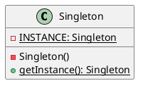

---
tags:
  - Java/DesignPattern
create_time: 2025-06-14 19:25
update_time: 2025/06/16 23:33
---

## 定义

单例模式是一种<mark style="background: #ABF7F7A6;">创建型</mark>设计模式，旨在保证**一个类仅有一个实例**，并**提供一个访问该实例的全局访问点**。


## 类图



## 实现方式

- **静态成员变量**：定义一个私有的静态成员变量 `INSTANCE`（类型为 `Singleton`），用于存储该类的唯一实例。
- **私有构造方法**：将构造方法私有化，防止外部使用 `new` 操作符直接创建对象实例。
- **全局访问点**：提供一个静态方法 `getInstance()` 作为全局访问点，该方法会返回存储在 `INSTANCE` 中的单例对象。

### 饿汉式

- 特点：在**类加载阶段**就创建单例对象并保存在静态变量中，因此天然**线程安全**，无须额外同步。
- 优缺点：
	- ✅ **优点**：无需加锁，执行效率高，响应更快，性能优于[[#懒汉式]]；
	- ❌ **缺点**：类加载时就创建实例，即使未使用也会占用内存，可能导致资源浪费。

```java hl:2,4-5,7-9
public class HungrySingleton {  
  private static final HungrySingleton INSTANCE = new HungrySingleton();  
  
  private HungrySingleton() {
  }  
  
  public static HungrySingleton getInstance() {  
    return INSTANCE;  
  }  
}
```

在上述代码中：

- 通过**私有构造方法**限制外部创建对象，确保类无法被外部实例化；
- 定义一个 `final` 静态成员变量 `INSTANCE`，在**类加载时初始化，且只初始化一次，确保实例唯一且不可更改**；
- 提供静态方法 `getInstance()` 作为**全局访问点**，直接返回该唯一实例，实现单例模式。

### 懒汉式

**特点**：只有在第一次调用 `getInstance()` 方法时，才会创建实例对象，属于**延迟加载**。

```java hl:2,4-5,7-12
public class LazySingleton {  
  private static LazySingleton INSTANCE;  
  
  private LazySingleton() {  
  }  
  
  public static LazySingleton getInstance() {  
    if (INSTANCE == null) {  
      INSTANCE = new LazySingleton();  
    }  
    return INSTANCE;  
  }  
}
```

在测试类 `ApiTest` 中添加如下测试方法：

```java
@Test  
public void testLazySingleton() {  
	Runnable runnable = () -> {  
		LazySingleton instance = LazySingleton.getInstance();  
		LOGGER.info("{}：{}", Thread.currentThread().getName(), instance);  
	};  
	Thread t1 = new Thread(runnable);  
	Thread t2 = new Thread(runnable);  
	t1.start();  
	t2.start();  
}  
```

经多次测试会发现：两个线程获取到的 `LazySingleton` 实例可能不相同，说明该实现方式**线程不安全**。如下所示：

```
23:00:20.943 [Thread-0] INFO fun.xiaorang.study.designpattern.singleton.ApiTest -- Thread-0：fun.xiaorang.study.designpattern.singleton.LazySingleton@4e54ffd6
23:00:20.943 [Thread-1] INFO fun.xiaorang.study.designpattern.singleton.ApiTest -- Thread-1：fun.xiaorang.study.designpattern.singleton.LazySingleton@6d2b14bd
```

### 双重检查锁

鉴于前面提到的[[#懒汉式]]单例模式在多线程环境下存在线程安全问题，最直接的改进方式是：在 `getInstance()` 方法上添加 **`synchronized`** 关键字，使其成为**同步方法**，从而保证线程安全：

```java hl:2,4-5,7-12
public class LazySingleton {  
  private static LazySingleton INSTANCE;  
  
  private LazySingleton() {  
  }  
  
  public static LazySingleton getInstance() {  
    if (INSTANCE == null) {  
      INSTANCE = new LazySingleton();  
    }  
    return INSTANCE;  
  }  
}
```

在测试类 `ApiTest` 中添加如下测试方法：

```java
@Test  
public void testLazySyncSingleton() {  
  Runnable runnable = () -> {  
    LazySyncSingleton instance = LazySyncSingleton.getInstance();  
    LOGGER.info("{}：{}", Thread.currentThread().getName(), instance);  
  };  
  Thread t1 = new Thread(runnable);  
  Thread t2 = new Thread(runnable);  
  t1.start();  
  t2.start();  
}
```

运行时我们会看到：当一个线程调用 `getInstance()` 时，另一个线程会被阻塞（状态变为 `MONITOR`），直至前者完成。如下图所示：
![[Pasted image 20250616231354.png]]

```
23:14:33.471 [Thread-0] INFO fun.xiaorang.study.designpattern.singleton.ApiTest -- Thread-0：fun.xiaorang.study.designpattern.singleton.LazySyncSingleton@8b43eba
23:14:33.471 [Thread-1] INFO fun.xiaorang.study.designpattern.singleton.ApiTest -- Thread-1：fun.xiaorang.study.designpattern.singleton.LazySyncSingleton@8b43eba
```

虽然线程安全问题解决了，但 **`synchronized` 每次调用都要加锁、释放，开销较大，性能较差**。有没有更优解呢？
🚀推荐方案：使用**双重检查锁（Double-Checked Locking，DCL）优化同步范围，仅在实例首次创建时加锁**：

```java hl:2,4-5,7-16
public class LazyDoubleCheckSingleton {  
  private static volatile LazyDoubleCheckSingleton INSTANCE;  
  
  private LazyDoubleCheckSingleton() {  
  }  
  
  public static LazyDoubleCheckSingleton getInstance() {  
    if (INSTANCE == null) {  
      synchronized (LazyDoubleCheckSingleton.class) {  
        if (INSTANCE == null) {  
          INSTANCE = new LazyDoubleCheckSingleton();  
        }  
      }  
    }  
    return INSTANCE;  
  }  
}
```

> [!tip] 关键点
> **`INSTANCE` 必须使用 `volatile` 修饰，防止<mark style="background: #FFB8EBA6;">指令重排</mark>导致对象未完全构造就被其他线程读取**。

在测试类 `ApiTest` 中添加如下测试方法：

```java
@Test  
public void testLazyDoubleCheckSingleton() {  
  Runnable runnable = () -> {  
    LazyDoubleCheckSingleton instance = LazyDoubleCheckSingleton.getInstance();  
    LOGGER.info("{}：{}", Thread.currentThread().getName(), instance);  
  };  
  Thread t1 = new Thread(runnable);  
  Thread t2 = new Thread(runnable);  
  t1.start();  
  t2.start();  
}
```

运行结果表明：无论执行多少次，两个线程始终获取到的是**同一个实例对象**，这说明通过双重检查锁（DCL）实现的单例模式能够有效保证**线程安全**。

> [!note]
> 虽然 DCL 是一种兼顾线程安全与性能的优秀方案，但由于 `volatile` 会抑制某些 JVM 优化，一般推荐使用更现代的实现方式，如[[#静态内部类]]。

### 静态内部类
