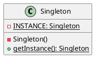

---
tags:
  - Java/DesignPattern
create_time: 2025-06-14 19:25
update_time: 2025/06/15 19:02
---

## 定义

单例模式是一种<mark style="background: #ABF7F7A6;">创建型</mark>设计模式，旨在保证**一个类只有一个实例**，并**提供一个访问该实例的全局访问点**。

## 类图

## 实现方式

- **静态成员变量**：定义一个私有的静态成员变量 `INSTANCE`（类型为 `Singleton`），用于存储该类的唯一实例。
- **私有构造方法**：将构造方法私有化，防止外部使用 `new` 操作符直接创建对象实例。
- **全局访问点**：提供一个静态方法 `getInstance()` 作为全局访问点，该方法会返回存储在 `INSTANCE` 中的单例对象。

### 饿汉式
