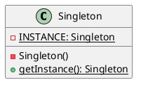

---
tags:
  - Java/DesignPattern
create_time: 2025-06-14 19:25
update_time: 2025/06/14 23:52
---

## 定义

单例模式是一种<mark style="background: #ABF7F7A6;">创建型</mark>设计模式，它确保**一个类只有一个实例**，并**提供一个访问该实例的全局访问点**。

## 类图

- 定义一个私有的静态成员变量 `INSTANCE`，类型为 `Singleton`，用于存储唯一实例。
- 构造方法私有化，禁止外部通过 `new Singleton()` 创建实例。
- 提供一个静态方法 `getInstance()` 用于返回 `Singleton` 实例：首次调用时创建实例并缓存至 `INSTANCE`，后续调用始终返回该实例。

## 实现方式

### 饿汉式
