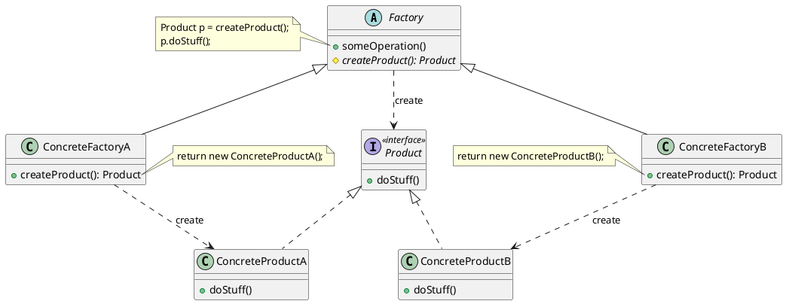

---
tags:
  - Java/DesignPattern
create_time: 2025/06/24 19:24
update_time: 2025/07/08 13:21
---

## 定义

工厂方法模式（Factory Method）是一种<mark style="background: #ABF7F7A6;">创建型</mark>设计模式，其核心思想是**将对象的实例化延迟到子类中实现**。**工厂父类定义一个创建对象的接口，但由工厂子类决定实例化哪一个具体的产品类。**

## 类图

- **Factory（抽象工厂）**：
- **ConcreteFctory （具体工厂）**：
- **Product（产品）**：
- **ConcreteProdcut（具体产品）**：
