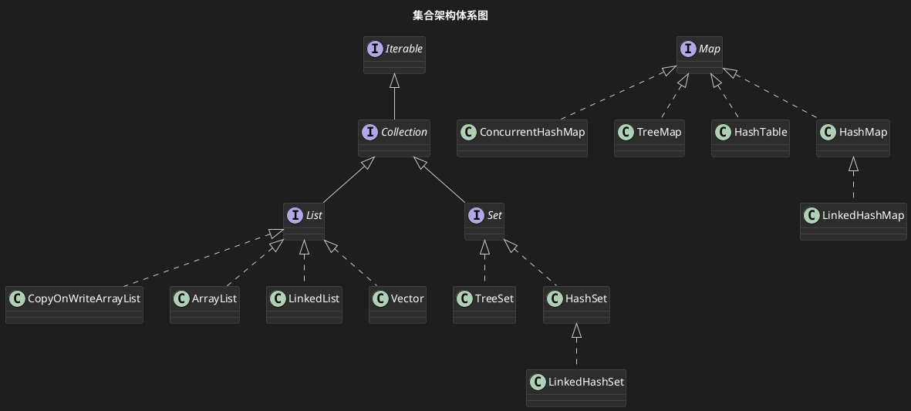

---
tags:
  - Java/Collection
create_time: 2024/12/12 23:55
update_time: 2025/08/11 13:36
---

```plantuml
@startuml
title 集合架构体系图

' 设置背景为深色
skinparam backgroundColor #1E1E1E

' 设置标题文字颜色为白色
skinparam titleFontColor white

' 设置默认文本颜色为白色
skinparam defaultTextColor white

' 设置类的背景和边框颜色
skinparam ClassBackgroundColor #2D2D2D
skinparam ClassBorderColor #555555
skinparam ClassFontColor white

' 设置类属性和方法的颜色
skinparam ClassAttributeIconColor #A0A0A0
skinparam ClassStereotypeFontColor #A0A0A0

' 连接线和箭头
skinparam ArrowColor #CCCCCC
skinparam LineColor #CCCCCC
skinparam ArrowFontColor #FFFFFF

interface Iterable {}
interface Collection extends Iterable {}
interface List extends Collection {}
class CopyOnWriteArrayList implements List {}
class ArrayList implements List {}
class LinkedList implements List {}
class Vector implements List {}
interface Set extends Collection {}
class TreeSet implements Set {}
class HashSet implements Set {}
class LinkedHashSet implements HashSet {}

interface Map {}
class ConcurrentHashMap implements Map {}
class TreeMap implements Map {}
class HashTable implements Map {}
class HashMap implements Map {}
class LinkedHashMap implements HashMap {}

@enduml
```
